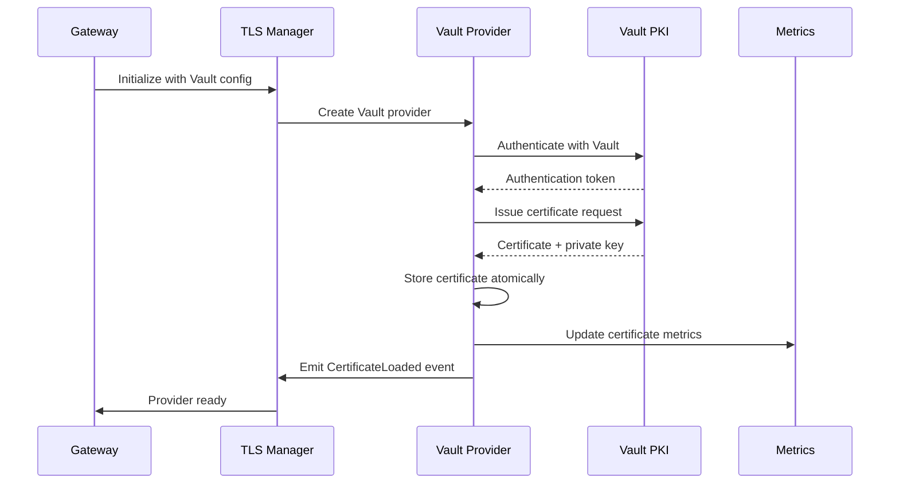
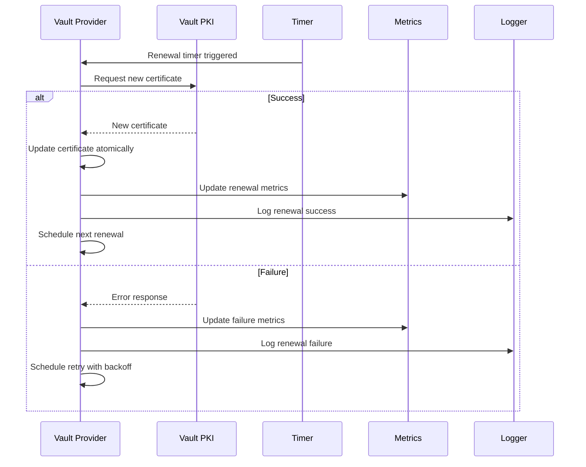
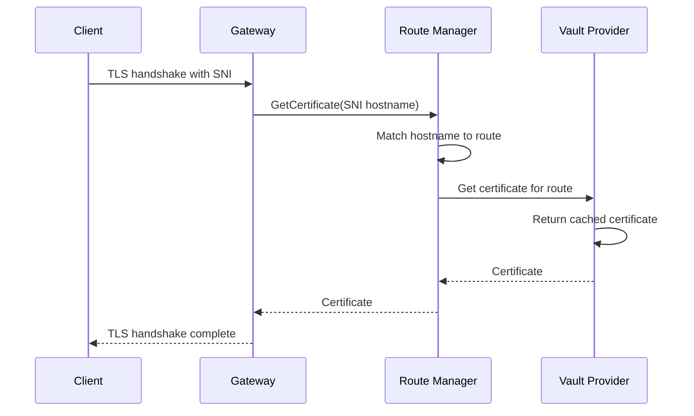
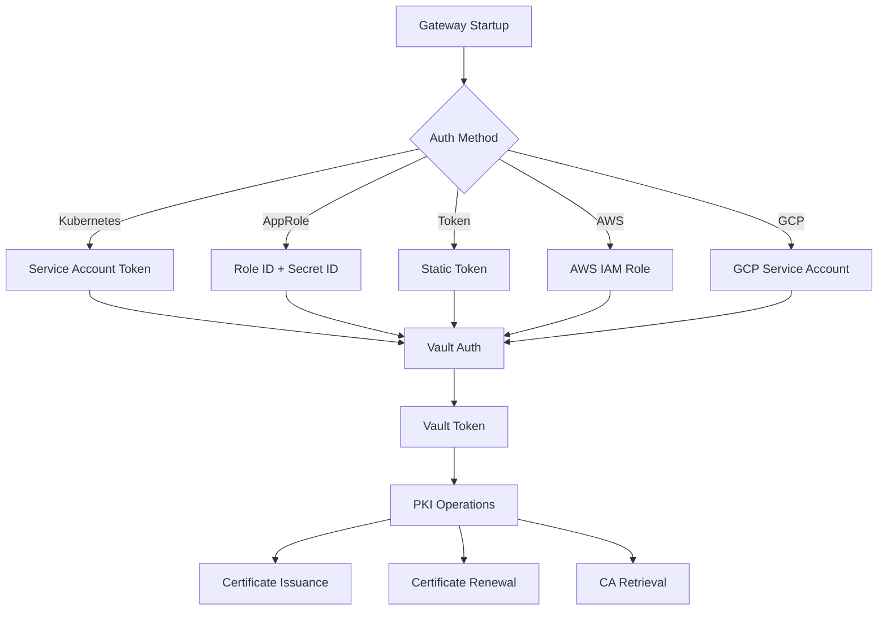
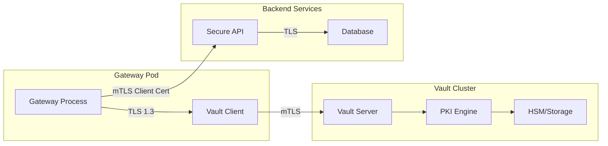
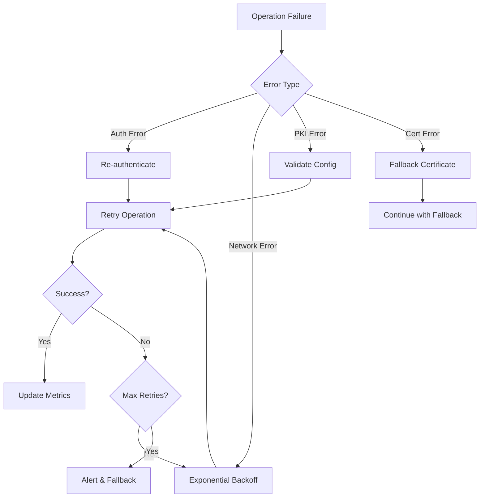

# Vault PKI Architecture Documentation

## Overview

This document describes the architectural design and implementation of Vault PKI integration in the AV API Gateway. The integration provides automated certificate management across three key areas: listener TLS, route-level TLS, and backend mTLS authentication.

**Recent Improvements:** The latest refactoring session (DEV-006) enhanced boolean environment variable parsing, including `VAULT_SKIP_VERIFY`, to support flexible true/false/yes/no/1/0 values for improved operational flexibility.

## Architecture Principles

### 1. Separation of Concerns

The Vault PKI integration follows a modular architecture with clear separation between:

- **Certificate Providers** - Abstract interface for certificate sources
- **Vault Client** - Vault-specific operations and authentication
- **TLS Manager** - Certificate lifecycle management and hot-reload
- **Route Manager** - SNI-based certificate selection
- **Backend TLS** - Client certificate management for backend connections

### 2. Circular Import Resolution

The architecture addresses circular import constraints between `vault` and `tls` packages using the **Factory Pattern**:

```go
// VaultProviderFactory function type in tls package
type VaultProviderFactory func(config *VaultTLSConfig, logger observability.Logger) (CertificateProvider, error)

// Injected at runtime in gateway initialization
tlsManager := tls.NewManager(
    tls.WithVaultProviderFactory(vault.NewTLSProvider),
)
```

This pattern allows:
- `tls` package remains independent of `vault` package
- `vault` package can implement `tls.CertificateProvider` interface
- Runtime dependency injection without circular imports

### 3. Hot-Reload Architecture

Certificate updates occur without service interruption through:

- **Atomic Pointer Updates** - Thread-safe certificate replacement
- **Event-Driven Renewal** - Proactive certificate renewal based on expiry
- **Graceful Fallback** - Fallback to existing certificates on renewal failure

## Component Architecture

### 1. Certificate Provider Interface

```go
type CertificateProvider interface {
    GetCertificate(ctx context.Context, info *tls.ClientHelloInfo) (*tls.Certificate, error)
    GetClientCA(ctx context.Context) (*x509.CertPool, error)
    Watch(ctx context.Context) <-chan CertificateEvent
    Close() error
}
```

**Responsibilities:**
- Abstract certificate source (file, Vault, etc.)
- Provide certificates for TLS handshakes
- Emit events for certificate lifecycle changes
- Support graceful shutdown

### 2. Vault TLS Provider

```go
type VaultTLSProvider struct {
    client     *Client
    config     *VaultTLSConfig
    logger     observability.Logger
    cert       atomic.Pointer[tls.Certificate]
    clientCA   atomic.Pointer[x509.CertPool]
    events     chan CertificateEvent
    renewTimer *time.Timer
    stopCh     chan struct{}
}
```

**Responsibilities:**
- Issue certificates from Vault PKI
- Manage certificate renewal lifecycle
- Emit certificate events for monitoring
- Handle Vault authentication and retries

### 3. TLS Manager

```go
type Manager struct {
    config           atomic.Pointer[TLSConfig]
    provider         CertificateProvider
    vaultFactory     VaultProviderFactory
    logger           observability.Logger
    metrics          *Metrics
    eventCh          chan CertificateEvent
}
```

**Responsibilities:**
- Coordinate certificate providers
- Handle configuration updates
- Manage certificate metrics
- Provide unified certificate access

### 4. Route TLS Manager

```go
type RouteTLSManager struct {
    providers        map[string]CertificateProvider
    vaultFactory     VaultProviderFactory
    logger           observability.Logger
    metrics          *Metrics
    mu               sync.RWMutex
}
```

**Responsibilities:**
- Manage per-route certificate providers
- Handle SNI-based certificate selection
- Coordinate route certificate updates
- Track route-specific metrics

### 5. Backend TLS Manager

```go
type BackendTLS struct {
    client       *http.Client
    vaultClient  vault.Client
    config       *BackendTLSConfig
    logger       observability.Logger
    cert         atomic.Pointer[tls.Certificate]
    renewTimer   *time.Timer
}
```

**Responsibilities:**
- Manage client certificates for backend connections
- Handle mTLS authentication
- Provide TLS-configured HTTP clients
- Manage certificate renewal for backends

## Data Flow Architecture

### 1. Certificate Issuance Flow



### 2. Certificate Renewal Flow



### 3. SNI Certificate Selection Flow



## Configuration Architecture

### 1. Configuration Hierarchy

```
Global Vault Config
├── Authentication (shared)
├── Connection settings (shared)
└── TLS settings (shared)

Listener TLS Config
├── Inherits: Global Vault config
├── PKI mount and role
├── Certificate parameters
└── Renewal settings

Route TLS Config
├── Inherits: Global Vault config
├── Per-route PKI settings
├── SNI hostname mapping
└── Route-specific parameters

Backend TLS Config
├── Inherits: Global Vault config
├── Client certificate settings
├── Server verification
└── mTLS parameters
```

### 2. Configuration Validation

```go
type ConfigValidator struct {
    vaultClient vault.Client
    logger      observability.Logger
}

func (v *ConfigValidator) ValidateVaultTLSConfig(config *VaultTLSConfig) error {
    // Validate PKI mount exists
    // Validate role permissions
    // Validate certificate parameters
    // Test certificate issuance
}
```

**Validation Steps:**
1. **Vault Connectivity** - Verify Vault server accessibility
2. **Authentication** - Validate Vault authentication method
3. **PKI Mount** - Confirm PKI secrets engine is enabled
4. **Role Permissions** - Verify role allows requested parameters
5. **Certificate Test** - Issue test certificate to validate configuration

## Security Architecture

### 1. Authentication Flow



### 2. Certificate Security

**Private Key Protection:**
- Private keys stored only in memory
- Atomic updates prevent key exposure
- Secure key generation in Vault HSM
- No private key persistence to disk

**Certificate Validation:**
- Full certificate chain validation
- Hostname verification for server certificates
- Client certificate validation for mTLS
- Certificate transparency logging support

**Access Control:**
- Least-privilege Vault policies
- Role-based certificate issuance
- Audit logging for all operations
- Secure credential management

### 3. Network Security



## Metrics and Observability Architecture

### 1. Metrics Collection

```go
type Metrics struct {
    CertificateExpiry    *prometheus.GaugeVec
    CertificateRenewals  *prometheus.CounterVec
    VaultOperations      *prometheus.CounterVec
    CertificateValidity  *prometheus.GaugeVec
    RenewalDuration      *prometheus.HistogramVec
}
```

**Key Metrics:**
- `gateway_tls_certificate_expiry_seconds` - Certificate expiry timestamps
- `gateway_tls_certificate_renewals_total` - Renewal success/failure counts
- `gateway_vault_pki_operations_total` - Vault PKI operation counts
- `gateway_tls_certificate_validity_seconds` - Certificate validity duration
- `gateway_tls_renewal_duration_seconds` - Time taken for renewals

### 2. Event Architecture

```go
type CertificateEvent struct {
    Type      CertificateEventType
    Source    string
    Message   string
    Error     error
    Timestamp time.Time
    Metadata  map[string]interface{}
}
```

**Event Types:**
- `CertificateEventLoaded` - Initial certificate load
- `CertificateEventReloaded` - Certificate renewal/update
- `CertificateEventExpiring` - Certificate approaching expiry
- `CertificateEventError` - Certificate operation failure

### 3. Logging Architecture

**Structured Logging:**
```json
{
  "level": "info",
  "timestamp": "2024-01-15T10:30:00Z",
  "component": "vault-tls-provider",
  "operation": "certificate-renewal",
  "vault_mount": "pki",
  "vault_role": "gateway-server",
  "common_name": "gateway.example.com",
  "ttl": "24h",
  "expires_at": "2024-01-16T10:30:00Z",
  "message": "Certificate renewed successfully"
}
```

**Audit Logging:**
- All certificate operations logged
- Vault authentication events
- Certificate validation failures
- Configuration changes

## Performance Architecture

### 1. Certificate Caching

```go
type CertificateCache struct {
    cert     atomic.Pointer[tls.Certificate]
    clientCA atomic.Pointer[x509.CertPool]
    expiry   time.Time
    mu       sync.RWMutex
}
```

**Caching Strategy:**
- In-memory certificate storage
- Atomic pointer updates for thread safety
- No disk I/O during TLS handshakes
- Proactive renewal before expiry

### 2. Connection Pooling

```go
type VaultClient struct {
    client     *vaultapi.Client
    httpClient *http.Client
    config     *Config
    auth       AuthMethod
}
```

**Connection Management:**
- HTTP/2 connection pooling to Vault
- Keep-alive connections
- Connection timeout configuration
- Retry logic with exponential backoff

### 3. Renewal Optimization

**Renewal Timing:**
- Configurable renewal window (default: 1 hour before expiry)
- Jitter to prevent thundering herd
- Exponential backoff on failures
- Circuit breaker for Vault connectivity

**Batch Operations:**
- Concurrent certificate renewals
- Bulk CA certificate retrieval
- Efficient SNI certificate lookup
- Minimal TLS handshake overhead

## Error Handling Architecture

### 1. Error Classification

```go
type ErrorType int

const (
    ErrorTypeVaultAuth ErrorType = iota
    ErrorTypePKIOperation
    ErrorTypeCertificateValidation
    ErrorTypeNetworkConnectivity
    ErrorTypeConfiguration
)
```

### 2. Retry Strategy



### 3. Graceful Degradation

**Fallback Mechanisms:**
- Use existing certificate on renewal failure
- Fall back to file-based certificates
- Disable mTLS on client cert failure
- Circuit breaker for Vault operations

**Health Checks:**
- Certificate expiry monitoring
- Vault connectivity checks
- PKI operation health
- Certificate validation status

## Deployment Architecture

### 1. Kubernetes Integration

```yaml
apiVersion: v1
kind: ServiceAccount
metadata:
  name: gateway-vault
  annotations:
    vault.hashicorp.com/role: gateway-role
---
apiVersion: rbac.authorization.k8s.io/v1
kind: ClusterRoleBinding
metadata:
  name: gateway-vault-auth
roleRef:
  apiGroup: rbac.authorization.k8s.io
  kind: ClusterRole
  name: system:auth-delegator
subjects:
- kind: ServiceAccount
  name: gateway-vault
  namespace: default
```

### 2. Vault Configuration

```hcl
# Kubernetes auth method
auth "kubernetes" {
  type = "kubernetes"
}

# PKI secrets engine
secrets "pki" {
  type = "pki"
}

# Gateway policy
policy "gateway-pki" {
  path "pki/issue/gateway-server" {
    capabilities = ["create", "update"]
  }
  
  path "pki/issue/gateway-client" {
    capabilities = ["create", "update"]
  }
}

# Kubernetes role
role "gateway-role" {
  bound_service_account_names = ["gateway-vault"]
  bound_service_account_namespaces = ["default"]
  policies = ["gateway-pki"]
  ttl = "1h"
  max_ttl = "24h"
}
```

### 3. High Availability

**Gateway HA:**
- Multiple gateway replicas
- Shared certificate state via Vault
- Independent certificate renewal
- Load balancer health checks

**Vault HA:**
- Vault cluster with HA storage
- Multiple Vault endpoints
- Automatic failover
- Consistent certificate issuance

This architecture provides a robust, secure, and scalable foundation for automated certificate management across the entire API gateway infrastructure.