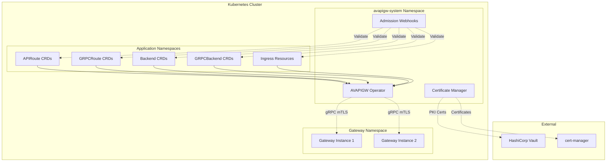

# AVAPIGW Operator Documentation

## Overview

The AVAPIGW Operator is a Kubernetes operator that provides declarative configuration management for the AVAPIGW API Gateway through Custom Resource Definitions (CRDs). It enables Kubernetes-native configuration management with comprehensive validation, automated certificate management, and secure communication.

## Table of Contents

- [Architecture](#architecture)
- [Deployment Modes](#deployment-modes)
- [RBAC Requirements](#rbac-requirements)
- [Certificate Management](#certificate-management)
- [Webhook Validation](#webhook-validation)
- [Communication Security](#communication-security)
- [Installation](#installation)
- [Configuration](#configuration)
- [Monitoring](#monitoring)
- [Troubleshooting](#troubleshooting)

## Architecture

The operator follows a modern Kubernetes operator pattern with enhanced security and reliability features:



### Key Components

#### 1. Operator Controllers
- **APIRoute Controller** - Manages HTTP route configuration with base reconciler pattern
- **GRPCRoute Controller** - Manages gRPC route configuration with base reconciler pattern
- **Backend Controller** - Manages HTTP backend configuration with base reconciler pattern
- **GRPCBackend Controller** - Manages gRPC backend configuration with base reconciler pattern
- **Ingress Controller** - Converts standard Kubernetes Ingress resources to gateway routes

**Generation-Based Reconciliation (TASK-009):**
- **Skip Optimization** - Ingress controller skips reconciliation when resource generation hasn't changed
- **Performance Improvement** - Reduces unnecessary processing for unchanged resources
- **Resource Efficiency** - Minimizes CPU usage and API server load

**Enhanced Finalizer Management (DEV-008 to DEV-011):**
- **No Redundant Requeue** - Finalizer addition no longer triggers unnecessary reconciliation loops
- **Patch-Based Updates** - Finalizer operations use Patch instead of Update to reduce API conflicts
- **Event Recording** - Annotation update failures now record Warning events for better observability
- **Deterministic Cleanup** - Cleanup operations iterate through resources in sorted order for consistency

#### 2. Enhanced Admission Webhooks
- **Validating Webhooks** - Validate CRD specifications before creation/update
- **Cross-CRD Duplicate Detection** - Prevent conflicting route configurations
- **Ingress Webhook Validation** - Validate Ingress resources when ingress controller is enabled
- **Cross-Reference Validation** - Ensure referenced backends exist

**Shared DuplicateChecker Pattern (TASK-007):**
- **Single Instance** - One shared DuplicateChecker across all webhooks for consistency
- **Cluster-Wide Checking** - Ingress webhook respects cluster-wide duplicate check flag (TASK-008)
- **Resource Efficiency** - Reduces memory usage and improves performance
- **Lifecycle Management** - Proper context-based lifecycle to prevent goroutine leaks

#### 3. Certificate Management System
- **Webhook Injector** - Automated CA injection into ValidatingWebhookConfigurations
- **Self-Signed Provider** - Generate and manage self-signed certificates
- **Vault PKI Provider** - Integrate with HashiCorp Vault for certificate management
- **Cert-Manager Provider** - Integrate with cert-manager for certificate lifecycle

#### 4. gRPC Communication
- **Configuration Service** - Push configuration updates to gateways
- **mTLS Security** - Secure communication using mutual TLS
- **Certificate Rotation** - Automatic certificate renewal and hot-reload

## Deployment Modes

The operator supports three deployment modes to accommodate different use cases:

### 1. Gateway-Only Mode (Default)
```yaml
operator:
  enabled: false
```
- Just the API Gateway without operator
- Configuration via YAML files
- Suitable for simple deployments

### 2. With-Operator Mode
```yaml
operator:
  enabled: true
  ingressController:
    enabled: false
```
- Gateway + Operator for CRD-based configuration management
- APIRoute, GRPCRoute, Backend, GRPCBackend CRDs
- Kubernetes-native configuration

### 3. With-Ingress Mode
```yaml
operator:
  enabled: true
  ingressController:
    enabled: true
    className: avapigw
```
- Gateway + Operator + Ingress Controller
- Standard Kubernetes Ingress support
- Rich annotation support for advanced features

## RBAC Requirements

The operator requires comprehensive RBAC permissions for full functionality:

### Core Resources

```yaml
# Events for recording reconciliation events
- apiGroups: [""]
  resources: ["events"]
  verbs: ["create", "patch"]

# Secrets for TLS certificates (read-only)
- apiGroups: [""]
  resources: ["secrets"]
  verbs: ["get", "list", "watch"]

# ConfigMaps for configuration storage
- apiGroups: [""]
  resources: ["configmaps"]
  verbs: ["get", "list", "watch", "create", "update", "patch", "delete"]

# Services and Endpoints for backend discovery
- apiGroups: [""]
  resources: ["services", "endpoints"]
  verbs: ["get", "list", "watch"]
```

### CRD Management

```yaml
# APIRoute, GRPCRoute, Backend, GRPCBackend
- apiGroups: ["avapigw.io"]
  resources: ["apiroutes", "grpcroutes", "backends", "grpcbackends"]
  verbs: ["get", "list", "watch", "create", "update", "patch", "delete"]

# Status updates
- apiGroups: ["avapigw.io"]
  resources: ["*/status"]
  verbs: ["get", "update", "patch"]
```

### Ingress Support (when ingress controller enabled)

```yaml
# Ingress resources
- apiGroups: ["networking.k8s.io"]
  resources: ["ingresses"]
  verbs: ["get", "list", "watch", "update", "patch"]

# Ingress status updates
- apiGroups: ["networking.k8s.io"]
  resources: ["ingresses/status"]
  verbs: ["update", "patch"]

# IngressClass management
- apiGroups: ["networking.k8s.io"]
  resources: ["ingressclasses"]
  verbs: ["get", "list", "watch", "create", "update", "patch"]
```

### Coordination and Security

```yaml
# Leader election
- apiGroups: ["coordination.k8s.io"]
  resources: ["leases"]
  verbs: ["get", "list", "watch", "create", "update", "patch", "delete"]

# Webhook CA injection
- apiGroups: ["admissionregistration.k8s.io"]
  resources: ["validatingwebhookconfigurations"]
  verbs: ["get", "list", "watch", "update", "patch"]
```

## Certificate Management

The operator supports three certificate management modes for webhook validation and gRPC communication:

### Self-Signed Mode (Default)

**Configuration:**
```yaml
operator:
  webhook:
    tls:
      mode: selfsigned
  grpc:
    tls:
      mode: selfsigned
```

**Features:**
- Automatically generates self-signed certificates
- Handles certificate rotation and CA injection
- No external dependencies required
- Suitable for development and testing

**Certificate Lifecycle:**
1. Generate CA certificate and private key
2. Generate server certificate signed by CA
3. Store certificates in Kubernetes secrets
4. Inject CA bundle into ValidatingWebhookConfigurations
5. Automatically rotate certificates before expiry

### Vault PKI Mode

**Configuration:**
```yaml
operator:
  webhook:
    tls:
      mode: vault
  grpc:
    tls:
      mode: vault

vault:
  enabled: true
  address: "https://vault.example.com:8200"
  authMethod: kubernetes
  role: avapigw-operator
  pki:
    enabled: true
    pkiMount: "pki"
    role: "operator-certs"
    commonName: "avapigw-operator.avapigw-system.svc"
    ttl: "24h"
```

**Features:**
- Integrates with HashiCorp Vault PKI
- Automatic certificate issuance and renewal
- Enterprise-grade certificate management
- Centralized certificate authority

**Prerequisites:**
- HashiCorp Vault with PKI secrets engine enabled
- Kubernetes authentication method configured
- Appropriate Vault policies and roles

### Cert-Manager Mode

**Configuration:**
```yaml
operator:
  webhook:
    tls:
      mode: cert-manager
  grpc:
    tls:
      mode: cert-manager
```

**Features:**
- Integrates with cert-manager for certificate lifecycle
- Supports various certificate issuers (Let's Encrypt, internal CA, etc.)
- Kubernetes-native certificate management
- Automatic renewal and rotation

**Prerequisites:**
- cert-manager installed in the cluster
- Appropriate ClusterIssuer or Issuer configured
- Certificate resources created for webhook and gRPC

## Webhook Validation

The operator provides comprehensive admission webhook validation:

### Validating Webhooks

#### CRD Validation
- **APIRoute Validation** - Validates route specifications, path matching, and destination references
- **GRPCRoute Validation** - Validates gRPC service/method matching and metadata rules
- **Backend Validation** - Validates host configurations, health checks, and load balancing settings
- **GRPCBackend Validation** - Validates gRPC-specific backend configurations

#### Cross-CRD Validation
- **Duplicate Detection** - Prevents conflicting route configurations across different CRDs
- **Reference Validation** - Ensures referenced backends exist and are accessible
- **Namespace Validation** - Validates cross-namespace references based on RBAC

#### Ingress Validation (when ingress controller enabled)
- **Annotation Validation** - Validates AVAPIGW-specific annotations
- **Path Type Support** - Validates supported path types (Exact, Prefix, ImplementationSpecific)
- **TLS Configuration** - Validates TLS section and certificate references

### Webhook Configuration

```yaml
operator:
  webhook:
    enabled: true
    port: 9443
    tls:
      mode: selfsigned  # or vault, cert-manager
    failurePolicy: Fail
    admissionReviewVersions: ["v1", "v1beta1"]
```

### CA Injection

The webhook injector automatically manages CA certificates:

1. **Monitor Certificate Changes** - Watch for certificate updates and rotations
2. **Extract CA Bundle** - Extract CA certificate from webhook certificates
3. **Update Webhook Configurations** - Inject CA bundle into ValidatingWebhookConfigurations
4. **Handle Failures** - Retry with exponential backoff on injection failures
5. **Metrics Collection** - Track injection success/failure rates

## Communication Security

### gRPC mTLS Communication

The operator communicates with gateway instances using secure gRPC with mutual TLS via Vault PKI:

**Configuration:**
```yaml
operator:
  grpc:
    port: 9444
    tls:
      mode: vault  # Vault PKI for production mTLS
    keepalive:
      time: 30s
      timeout: 10s

vault:
  enabled: true
  address: "https://vault.example.com:8200"
  authMethod: kubernetes
  role: avapigw-operator
  pki:
    enabled: true
    pkiMount: "pki"
    role: "operator-certs"
    commonName: "avapigw-operator.avapigw-system.svc"
    ttl: "24h"
```

**Security Features:**
- **Mutual Authentication** - Both operator and gateway verify each other's identity using Vault PKI certificates
- **Encryption** - All communication is encrypted in transit with TLS 1.3
- **Certificate Rotation** - Automatic certificate renewal via Vault PKI without service interruption
- **Connection Pooling** - Efficient connection management with keepalive
- **Vault Integration** - Centralized certificate management and rotation

### Protocol Definition

The ConfigurationService uses a modern streaming-based approach for efficient configuration management:

```protobuf
service ConfigurationService {
  // RegisterGateway registers a gateway instance with the operator.
  // Returns the initial configuration snapshot.
  rpc RegisterGateway(RegisterGatewayRequest) returns (RegisterGatewayResponse);

  // StreamConfiguration establishes a server-side streaming connection
  // for receiving configuration updates from the operator.
  rpc StreamConfiguration(StreamConfigurationRequest) returns (stream ConfigurationUpdate);

  // GetConfiguration returns the current configuration snapshot.
  rpc GetConfiguration(GetConfigurationRequest) returns (ConfigurationSnapshot);

  // Heartbeat sends a keep-alive signal to the operator.
  rpc Heartbeat(HeartbeatRequest) returns (HeartbeatResponse);

  // AcknowledgeConfiguration acknowledges receipt and application of a configuration update.
  rpc AcknowledgeConfiguration(AcknowledgeConfigurationRequest) returns (AcknowledgeConfigurationResponse);
}
```

### Configuration Management Flow

1. **Gateway Registration**
   - Gateway connects to operator gRPC service
   - Registers with capabilities and metadata
   - Receives initial configuration snapshot
   - Gets assigned session ID and heartbeat interval

2. **Configuration Streaming**
   - Gateway establishes streaming connection
   - Operator pushes configuration updates in real-time
   - Updates include resource additions, modifications, deletions
   - Full sync capability for recovery scenarios

3. **Heartbeat Maintenance**
   - Gateway sends periodic heartbeats (default: 30s)
   - Reports current status and last applied configuration
   - Operator can signal reconnection if needed

4. **Configuration Acknowledgment**
   - Gateway acknowledges successful configuration application
   - Reports any errors or application duration
   - Enables operator to track configuration state

### OpenTelemetry Tracing

All gRPC operations include comprehensive OpenTelemetry tracing:

- **Span Creation** - Each RPC call creates a server span
- **Attribute Enrichment** - Gateway name, namespace, and operation details
- **Performance Tracking** - Request duration and success metrics
- **Distributed Tracing** - Trace context propagation for end-to-end visibility
- **Error Tracking** - Failed operations captured with error details

Example trace attributes:
```
gateway.name: "gateway-1"
gateway.namespace: "avapigw-system"
config_version: "123"
total_resources: 42
```

## Installation

### Prerequisites

- Kubernetes 1.23+
- Helm 3.0+
- RBAC enabled cluster
- (Optional) HashiCorp Vault for PKI mode
- (Optional) cert-manager for cert-manager mode

### Basic Installation

```bash
# Install gateway with operator enabled
helm install avapigw ./helm/avapigw \
  --set operator.enabled=true \
  -n avapigw \
  --create-namespace

# Verify installation
kubectl get pods -n avapigw
kubectl get crd | grep avapigw.io
```

### Installation with Ingress Controller

```bash
# Install with ingress controller enabled
helm install avapigw ./helm/avapigw \
  --set operator.enabled=true \
  --set operator.ingressController.enabled=true \
  --set operator.ingressController.className=avapigw \
  -n avapigw \
  --create-namespace
```

### Installation with Vault PKI

```bash
# Install with Vault PKI certificate management for operator gRPC TLS
helm install avapigw ./helm/avapigw \
  --set operator.enabled=true \
  --set operator.webhook.tls.mode=vault \
  --set operator.grpc.tls.mode=vault \
  --set vault.enabled=true \
  --set vault.address="https://vault.example.com:8200" \
  --set vault.authMethod=kubernetes \
  --set vault.role=avapigw-operator \
  --set vault.pki.enabled=true \
  --set vault.pki.pkiMount=pki \
  --set vault.pki.role=operator-certs \
  -n avapigw \
  --create-namespace

# Verify mTLS communication between operator and gateway
kubectl logs -n avapigw -l app.kubernetes.io/name=avapigw-operator | grep "gRPC connection established"
kubectl logs -n avapigw -l app.kubernetes.io/name=avapigw-gateway | grep "operator connection"
```

## Configuration

### CRD Examples for All Supported Features

The operator supports comprehensive CRD-based configuration covering all gateway features. A complete example configuration is available at:

**File**: `test/performance/configs/crds-full-features.yaml`

**Key CRD Resources:**

#### APIRoute Examples
```yaml
# HTTP route with Redis Sentinel cache and rate limiting
apiVersion: avapigw.io/v1alpha1
kind: APIRoute
metadata:
  name: items-api-cached
  namespace: avapigw-test
spec:
  match:
    - uri:
        prefix: /api/v1/items
  route:
    - destination:
        host: host.docker.internal
        port: 8801
      weight: 50
    - destination:
        host: host.docker.internal
        port: 8802
      weight: 50
  cache:
    enabled: true
    ttl: 60s
    staleWhileRevalidate: 30s
  rateLimit:
    enabled: true
    requestsPerSecond: 50
    burst: 100

# JWT Authentication with Keycloak
apiVersion: avapigw.io/v1alpha1
kind: APIRoute
metadata:
  name: auth-keycloak
spec:
  match:
    - uri:
        prefix: /api/v1/secure/
  route:
    - destination:
        host: host.docker.internal
        port: 8801
  authentication:
    enabled: true
    jwt:
      enabled: true
      issuer: http://host.docker.internal:8090/realms/gateway-test
      jwksUrl: http://host.docker.internal:8090/realms/gateway-test/protocol/openid-connect/certs
```

#### GRPCRoute Examples
```yaml
# gRPC route with cache and JWT authentication
apiVersion: avapigw.io/v1alpha1
kind: GRPCRoute
metadata:
  name: grpc-cached
spec:
  match:
    - service:
        exact: api.v1.TestService
  route:
    - destination:
        host: host.docker.internal
        port: 8803
  cache:
    enabled: true
    ttl: 60s
  authentication:
    enabled: true
    jwt:
      enabled: true
      issuer: http://host.docker.internal:8090/realms/gateway-test
```

#### Backend and GRPCBackend Examples
```yaml
# HTTP Backend with health checks
apiVersion: avapigw.io/v1alpha1
kind: Backend
metadata:
  name: rest-backend-1
spec:
  hosts:
    - address: host.docker.internal
      port: 8801
  healthCheck:
    path: /health
    interval: 10s
    timeout: 5s
  loadBalancer:
    algorithm: roundRobin

# gRPC Backend with connection pooling
apiVersion: avapigw.io/v1alpha1
kind: GRPCBackend
metadata:
  name: grpc-backend-1
spec:
  hosts:
    - address: host.docker.internal
      port: 8803
  connectionPool:
    maxConnsPerHost: 100
    maxIdleConns: 50
    idleConnTimeout: 90s
```

### Operator Configuration

```yaml
operator:
  enabled: true
  replicaCount: 1
  
  # Leader election for HA
  leaderElection:
    enabled: true
    resourceName: avapigw-operator-leader
  
  # Webhook configuration
  webhook:
    enabled: true
    port: 9443
    tls:
      mode: selfsigned  # selfsigned, vault, cert-manager
    failurePolicy: Fail
  
  # gRPC server configuration
  grpc:
    port: 9444
    tls:
      mode: selfsigned  # selfsigned, vault, cert-manager
    keepalive:
      time: 30s
      timeout: 10s
  
  # Metrics and health
  metrics:
    enabled: true
    port: 8080
  health:
    port: 8081
  
  # Ingress controller
  ingressController:
    enabled: false
    className: avapigw
    isDefaultClass: false
    lbAddress: ""  # LoadBalancer IP for status updates
  
  # Resources
  resources:
    limits:
      cpu: 500m
      memory: 256Mi
    requests:
      cpu: 100m
      memory: 128Mi
```

### Vault Configuration

```yaml
vault:
  enabled: true
  address: "https://vault.example.com:8200"
  authMethod: kubernetes  # kubernetes, token, approle
  role: avapigw-operator
  
  # TLS configuration for Vault connection
  tls:
    enabled: true
    caSecretName: vault-ca-cert
    skipVerify: false
  
  # PKI configuration
  pki:
    enabled: true
    pkiMount: "pki"
    role: "operator-certs"
    commonName: "avapigw-operator.avapigw-system.svc"
    altNames:
      - "avapigw-operator"
      - "avapigw-operator.avapigw-system"
    ttl: "24h"
    renewBefore: "1h"
```

## Monitoring

### Prometheus Metrics

The operator exposes comprehensive metrics for monitoring across all components:

#### Controller Metrics
```prometheus
# Reconciliation metrics
controller_runtime_reconcile_total{controller="apiroute"} 42
controller_runtime_reconcile_errors_total{controller="apiroute"} 0
controller_runtime_reconcile_time_seconds{controller="apiroute"} 0.123

# Work queue metrics
workqueue_adds_total{name="apiroute"} 42
workqueue_depth{name="apiroute"} 0
workqueue_queue_duration_seconds{name="apiroute"} 0.001

# Controller-specific metrics
avapigw_operator_reconcile_total{controller="apiroute",result="success"} 38
avapigw_operator_reconcile_total{controller="apiroute",result="error"} 4
avapigw_operator_reconcile_duration_seconds{controller="apiroute"} 0.125
avapigw_operator_reconcile_errors_total{controller="apiroute",error_type="validation"} 2
```

#### Custom Operator Metrics
```prometheus
# CRD management
avapigw_operator_crds_total{type="apiroute"} 10
avapigw_operator_crds_total{type="grpcroute"} 5
avapigw_operator_crds_total{type="backend"} 8
avapigw_operator_crds_total{type="grpcbackend"} 3

# Gateway communication
avapigw_operator_gateways_connected 2
avapigw_operator_config_push_total{status="success"} 156
avapigw_operator_config_push_total{status="error"} 3
avapigw_operator_config_push_errors_total{error_type="connection_failed"} 2
avapigw_operator_config_push_errors_total{error_type="validation_failed"} 1
avapigw_operator_config_push_duration_seconds 0.025

# gRPC client metrics
avapigw_operator_grpc_requests_total{method="ApplyAPIRoute",status="success"} 45
avapigw_operator_grpc_requests_total{method="ApplyBackend",status="success"} 20
avapigw_operator_grpc_request_duration_seconds{method="ApplyAPIRoute"} 0.015
avapigw_operator_grpc_connections_active 2
avapigw_operator_grpc_connection_errors_total{error_type="tls_handshake_failed"} 1
```

#### Webhook Metrics
```prometheus
# Webhook validation
avapigw_operator_webhook_requests_total{webhook="apiroute",status="allowed"} 100
avapigw_operator_webhook_requests_total{webhook="apiroute",status="denied"} 2
avapigw_operator_webhook_requests_total{webhook="grpcroute",status="allowed"} 25
avapigw_operator_webhook_requests_total{webhook="backend",status="allowed"} 40
avapigw_operator_webhook_duration_seconds{webhook="apiroute"} 0.005
avapigw_operator_webhook_validation_errors_total{webhook="apiroute",error_type="invalid_spec"} 2
avapigw_operator_webhook_validation_errors_total{webhook="backend",error_type="missing_reference"} 1

# Cross-CRD validation metrics
avapigw_operator_webhook_cross_validation_total{type="duplicate_route"} 1
avapigw_operator_webhook_cross_validation_total{type="missing_backend"} 2
avapigw_operator_webhook_cross_validation_duration_seconds 0.003
```

#### Certificate Management Metrics
```prometheus
# Certificate lifecycle
avapigw_operator_cert_renewals_total{mode="selfsigned",status="success"} 5
avapigw_operator_cert_renewals_total{mode="vault",status="success"} 8
avapigw_operator_cert_renewals_total{mode="cert-manager",status="success"} 3
avapigw_operator_cert_renewal_errors_total{mode="vault",error_type="auth_failed"} 1
avapigw_operator_cert_renewal_duration_seconds{mode="selfsigned"} 0.150
avapigw_operator_cert_expiry_seconds{cert_type="webhook"} 2073600
avapigw_operator_cert_expiry_seconds{cert_type="grpc"} 2073600

# CA injection metrics
avapigw_operator_webhook_ca_injections_total{status="success"} 10
avapigw_operator_webhook_ca_injections_total{status="error"} 1
avapigw_operator_webhook_ca_injection_duration_seconds 0.050
avapigw_operator_webhook_ca_injection_errors_total{error_type="api_server_error"} 1

# Certificate provider metrics
avapigw_operator_cert_provider_requests_total{provider="vault",operation="issue"} 15
avapigw_operator_cert_provider_requests_total{provider="selfsigned",operation="generate"} 8
avapigw_operator_cert_provider_errors_total{provider="vault",error_type="pki_unavailable"} 1
```

#### Ingress Controller Metrics (when enabled)
```prometheus
# Ingress processing
avapigw_operator_ingress_processed_total{status="success"} 25
avapigw_operator_ingress_processed_total{status="error"} 2
avapigw_operator_ingress_processing_duration_seconds 0.045
avapigw_operator_ingress_conversion_errors_total{error_type="unsupported_annotation"} 1
avapigw_operator_ingress_conversion_errors_total{error_type="invalid_path_type"} 1

# Annotation processing
avapigw_operator_ingress_annotations_processed_total{annotation_group="auth"} 15
avapigw_operator_ingress_annotations_processed_total{annotation_group="tls"} 10
avapigw_operator_ingress_annotation_errors_total{annotation="avapigw.io/rate-limit",error_type="invalid_value"} 1
```

#### Build Information and Uptime
```prometheus
# Operator build info
avapigw_operator_build_info{version="v1.0.0",commit="abc123",build_time="2026-02-14"} 1
avapigw_operator_start_time_seconds 1708000000
avapigw_operator_uptime_seconds 86400
```

### Enhanced Grafana Dashboards

The operator includes comprehensive Grafana dashboards with significant enhancements from the latest refactoring session:

#### Dashboard Updates (Latest Refactoring Session)
- **Gateway Dashboard**: 47 new panels added for comprehensive gateway metrics coverage
- **Operator Dashboard**: 7 new panels added for enhanced operator monitoring
- **Metric Name Fixes**: 9 metric name mismatches corrected (avapigw_ → gateway_)

#### Gateway Operator Dashboard (`monitoring/grafana/gateway-operator-dashboard.json`)

**New Panels Added:**
1. **gRPC ConfigurationService Metrics** - Request rates, latency, and connection tracking
2. **Certificate Management** - Certificate expiry, renewals, and provider metrics  
3. **Webhook Validation** - Admission webhook performance and error rates
4. **CA Injection Status** - ValidatingWebhookConfiguration CA bundle injection metrics
5. **Controller Reconciliation** - Per-controller reconciliation rates and errors
6. **Session Management** - Gateway registration and session tracking
7. **Configuration Streaming** - Real-time configuration update metrics
8. **Heartbeat Monitoring** - Gateway heartbeat success rates and intervals
9. **Resource Tracking** - CRD counts and resource management metrics
10. **Error Analysis** - Detailed error breakdown by component and type

#### Gateway Dashboard (`monitoring/grafana/gateway-dashboard.json`)

**47 New Panels Added:**
- **Authentication & Authorization** - JWT, API Key, OIDC, mTLS, RBAC, ABAC metrics
- **gRPC Operations** - Comprehensive gRPC request tracking and streaming metrics
- **Config Reload** - Hot configuration reload success/failure tracking
- **Enhanced Cache Metrics** - Memory and Redis cache performance
- **WebSocket Monitoring** - Connection and message throughput metrics
- **TLS & Security** - Certificate lifecycle and security event tracking
- **Backend Health** - Enhanced backend monitoring and health checks

**Dashboard Features:**
- **Multi-Instance Support** - Metrics aggregated across operator replicas
- **Time Range Filtering** - Configurable time ranges for analysis
- **Alert Integration** - Visual indicators for alert conditions
- **Drill-Down Capability** - Links to detailed views and logs
- **Performance Baselines** - Historical performance comparison

#### Usage Examples

```bash
# Import dashboards to Grafana
kubectl apply -f monitoring/grafana/

# Access via port-forward
kubectl port-forward -n monitoring svc/grafana 3000:3000

# Direct dashboard URLs
http://localhost:3000/d/avapigw-operator/avapigw-operator-dashboard
http://localhost:3000/d/avapigw-gateway/avapigw-gateway-dashboard
```

### ServiceMonitor Configuration

```yaml
serviceMonitor:
  enabled: true
  interval: 30s
  scrapeTimeout: 10s
  labels:
    app.kubernetes.io/name: avapigw-operator
  annotations:
    prometheus.io/scrape: "true"
```

### Health Checks

```bash
# Health check
curl http://operator:8081/healthz

# Readiness check  
curl http://operator:8081/readyz

# Metrics endpoint
curl http://operator:8080/metrics
```

## Troubleshooting

### Common Issues

#### 1. Operator Pod Not Starting

**Symptoms:**
```
Error: failed to create webhook server: unable to load certificates
```

**Solutions:**
- Check certificate management mode configuration
- Verify Vault connectivity (if using Vault mode)
- Check cert-manager installation (if using cert-manager mode)
- Review RBAC permissions for certificate access

#### 2. Webhook Validation Failures

**Symptoms:**
```
Error: admission webhook denied the request: validation failed
```

**Solutions:**
- Check webhook certificate validity
- Verify CA injection in ValidatingWebhookConfigurations
- Review webhook logs for detailed error messages
- Test webhook connectivity manually

#### 3. gRPC ConfigurationService Errors

**Symptoms:**
```
Error: failed to connect to gateway: connection refused
Error: gateway registration failed
Error: configuration stream interrupted
```

**Solutions:**
- Verify operator gRPC ConfigurationService is running on port 9444
- Check mTLS certificate configuration for both operator and gateway
- Validate network connectivity between operator and gateway
- Review firewall and network policies
- Check gateway session management and heartbeat intervals
- Verify configuration snapshot building and streaming logic

#### 4. RBAC Permission Denied

**Symptoms:**
```
Error: cannot create resource "configmaps" in API group ""
```

**Solutions:**
- Verify ClusterRole and ClusterRoleBinding are applied
- Check service account configuration
- Review RBAC permissions for missing resources
- Ensure operator has access to required namespaces

### Debugging Commands

```bash
# Check operator logs
kubectl logs -n avapigw -l app.kubernetes.io/name=avapigw-operator

# Check webhook configuration
kubectl get validatingwebhookconfiguration avapigw-operator-webhook -o yaml

# Check certificates
kubectl get secrets -n avapigw | grep cert
kubectl describe secret avapigw-operator-webhook-certs -n avapigw

# Check CRD status
kubectl get apiroutes -A
kubectl describe apiroute <name> -n <namespace>

# Check operator metrics
kubectl port-forward -n avapigw svc/avapigw-operator-metrics 8080:8080
curl http://localhost:8080/metrics

# Test webhook manually
kubectl apply --dry-run=server -f test-apiroute.yaml
```

### Log Analysis

Enable debug logging for detailed troubleshooting:

```yaml
operator:
  logLevel: debug
  logFormat: json
```

Look for these log patterns:
- `Reconciling APIRoute` - Controller reconciliation events
- `Webhook validation` - Admission webhook processing
- `Certificate renewed` - Certificate management events
- `gRPC connection established` - Gateway communication
- `CA bundle injected` - Webhook CA injection events

## Best Practices

### Security

1. **Use Least-Privilege RBAC** - Only grant necessary permissions
2. **Enable mTLS** - Always use mutual TLS for gRPC communication
3. **Rotate Certificates** - Configure appropriate certificate TTL and renewal
4. **Network Policies** - Restrict network access to operator components
5. **Audit Logging** - Enable audit logging for security events

### Performance

1. **Resource Limits** - Set appropriate CPU and memory limits
2. **Leader Election** - Enable leader election for HA deployments
3. **Metrics Monitoring** - Monitor reconciliation performance
4. **Batch Operations** - Use efficient status update patterns
5. **Connection Pooling** - Configure gRPC keepalive settings

### Reliability

1. **Health Checks** - Configure liveness and readiness probes
2. **Graceful Shutdown** - Handle SIGTERM signals properly
3. **Error Handling** - Implement retry logic with exponential backoff
4. **Status Reporting** - Provide clear status conditions and messages
5. **Monitoring** - Set up comprehensive monitoring and alerting

## Related Documentation

- **[CRD Reference](crd-reference.md)** - Complete CRD specification and examples
- **[Installation Guide](installation.md)** - Detailed installation instructions
- **[Configuration Guide](configuration.md)** - Operator configuration options
- **[Vault PKI Integration](vault-pki.md)** - Certificate management setup
- **[Webhook Configuration](webhook-configuration.md)** - Webhook and certificate configuration
- **[Troubleshooting](troubleshooting.md)** - Common issues and solutions