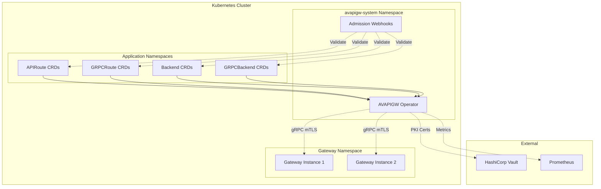

# AVAPIGW Operator

The AVAPIGW Operator is a Kubernetes operator that manages API Gateway configuration through Custom Resource Definitions (CRDs). It provides a declarative, Kubernetes-native way to configure routes and backends for the AVAPIGW API Gateway.

## Table of Contents

- [Overview](#overview)
- [Architecture](#architecture)
- [Key Features](#key-features)
- [Quick Start](#quick-start)
- [CRDs](#crds)
- [Communication](#communication)
- [Security](#security)
- [Monitoring](#monitoring)
- [Next Steps](#next-steps)

## Overview

The AVAPIGW Operator bridges the gap between Kubernetes-native configuration management and the AVAPIGW API Gateway. Instead of managing gateway configuration through YAML files, you can use Kubernetes Custom Resources to define routes, backends, and their associated policies.

### Why Use the Operator?

- **Kubernetes-Native** - Leverage kubectl, GitOps, and existing Kubernetes tooling
- **Declarative Configuration** - Define desired state, let the operator handle the rest
- **Hot Updates** - Apply configuration changes without gateway restarts
- **Validation** - Admission webhooks prevent invalid configurations
- **Status Reporting** - Real-time feedback on configuration status
- **Multi-Gateway** - Manage multiple gateway instances from a single operator

## Architecture



### Components

#### 1. Operator Controllers
- **APIRoute Controller** - Manages HTTP route configuration with enhanced IngressReconciler pattern alignment
- **GRPCRoute Controller** - Manages gRPC route configuration with base reconciler pattern
- **Backend Controller** - Manages HTTP backend configuration with base reconciler pattern
- **GRPCBackend Controller** - Manages gRPC backend configuration with base reconciler pattern
- **Ingress Controller** - Converts standard Kubernetes Ingress resources to gateway routes

#### 2. Enhanced Admission Webhooks
- **Validating Webhooks** - Validate CRD specifications before creation/update with improved validation constants
- **Cross-CRD Duplicate Detection** - Prevent conflicting route configurations across Backend vs GRPCBackend with context-based lifecycle management
- **Ingress Webhook Validation** - Validate Ingress resources when ingress controller is enabled
- **Cross-Reference Validation** - Ensure referenced backends exist with enhanced port range and weight validation

#### 3. gRPC Communication
- **Configuration Service** - Push configuration updates to gateways
- **mTLS Security** - Secure communication using mutual TLS
- **Certificate Management** - Automated certificate provisioning and rotation

#### 4. Certificate Management
- **Self-Signed Mode** - Generate and manage certificates automatically with thread-safe atomic operations
- **Vault PKI Mode** - Integrate with HashiCorp Vault for certificate management with improved thread safety
- **Auto-Rotation** - Automatic certificate renewal before expiry with atomic state management

## Key Features

### Declarative Configuration

Define your gateway configuration using Kubernetes resources:

```yaml
apiVersion: avapigw.io/v1alpha1
kind: APIRoute
metadata:
  name: api-v1
  namespace: production
spec:
  match:
    - uri:
        prefix: /api/v1
      methods: [GET, POST]
  route:
    - destination:
        host: api-backend
        port: 8080
  timeout: 30s
  retries:
    attempts: 3
    perTryTimeout: 10s
```

### Ingress Controller Support

Convert standard Kubernetes Ingress resources to gateway configuration:

```yaml
apiVersion: networking.k8s.io/v1
kind: Ingress
metadata:
  name: api-ingress
  annotations:
    avapigw.io/timeout: "30s"
    avapigw.io/retries: "3"
spec:
  ingressClassName: avapigw
  rules:
  - host: api.example.com
    http:
      paths:
      - path: /api/v1
        pathType: Prefix
        backend:
          service:
            name: api-service
            port:
              number: 8080
```

### Hot Configuration Updates

Configuration changes are applied immediately without gateway restarts:

```bash
# Update route timeout
kubectl patch apiroute api-v1 --type='merge' -p='{"spec":{"timeout":"60s"}}'

# Configuration is pushed to gateways automatically
```

### Status Reporting

Real-time status updates show configuration state with improved status handling:

```bash
kubectl get apiroutes
# NAME     READY   AGE
# api-v1   True    5m

kubectl describe apiroute api-v1
# Status:
#   Conditions:
#     Type:    Ready
#     Status:  True
#     Reason:  Reconciled
#     Message: Route successfully applied to 2 gateways
#     Last Transition Time: 2026-02-05T10:30:00Z
#     Generation: 2
```

Status updates now use Patch instead of Update for better performance and reduced conflicts.

### Admission Webhooks

Prevent invalid configurations before they're applied:

```bash
# This will be rejected by the webhook
kubectl apply -f - <<EOF
apiVersion: avapigw.io/v1alpha1
kind: APIRoute
metadata:
  name: invalid-route
spec:
  match:
    - uri:
        prefix: /api/v1  # Duplicate route!
EOF
# Error: admission webhook denied the request: duplicate route match found
```

## Quick Start

### Prerequisites

- Kubernetes 1.23+
- Helm 3.0+
- AVAPIGW gateway instances

### 1. Install the Operator

The operator is now part of the main Helm chart and can be enabled optionally:

```bash
# Install gateway with operator enabled
helm install avapigw ./helm/avapigw \
  --set operator.enabled=true \
  -n avapigw \
  --create-namespace

# Verify installation
kubectl get pods -n avapigw
kubectl get crd | grep avapigw.io
```

### 2. Configure Gateway Connection

The operator needs to communicate with gateway instances. Configure the gRPC connection:

```yaml
# values.yaml
grpc:
  port: 9444
  tls:
    mode: selfsigned  # or 'vault' for Vault PKI
```

### 3. Create Your First Resources

```bash
# Create a backend
kubectl apply -f - <<EOF
apiVersion: avapigw.io/v1alpha1
kind: Backend
metadata:
  name: hello-backend
spec:
  hosts:
    - address: hello-service.default.svc.cluster.local
      port: 8080
      weight: 1
  healthCheck:
    path: /health
    interval: 10s
    timeout: 5s
EOF

# Create a route
kubectl apply -f - <<EOF
apiVersion: avapigw.io/v1alpha1
kind: APIRoute
metadata:
  name: hello-route
spec:
  match:
    - uri:
        prefix: /hello
      methods: [GET]
  route:
    - destination:
        host: hello-service
        port: 8080
EOF
```

### 4. Verify Configuration

```bash
# Check resource status
kubectl get apiroutes,backends
kubectl describe apiroute hello-route
kubectl describe backend hello-backend

# Check operator logs
kubectl logs -n avapigw-system -l app.kubernetes.io/name=avapigw-operator
```

## CRDs

The operator manages four types of Custom Resource Definitions:

### APIRoute
Configures HTTP routes with advanced matching, traffic management, and policies.

**Key Features:**
- URI, method, header, and query parameter matching
- Load balancing with weighted destinations
- Retry policies and timeouts
- Header manipulation and URL rewriting
- Rate limiting and CORS
- TLS configuration with Vault PKI support

### GRPCRoute
Configures gRPC routes with service and method matching.

**Key Features:**
- Service and method name matching
- Metadata-based routing
- gRPC-specific retry policies
- Field mask transformations
- Rate limiting and security

### Backend
Configures HTTP backend services with health checking and load balancing.

**Key Features:**
- Multiple host configuration with weights
- Health check configuration
- Load balancing algorithms (round-robin, weighted, least connections)
- Circuit breaker configuration
- Authentication (JWT, Basic, mTLS)
- TLS configuration for backend connections

### GRPCBackend
Configures gRPC backend services with gRPC-specific features.

**Key Features:**
- gRPC health check protocol support
- Connection pool management
- Load balancing for gRPC services
- Authentication and TLS configuration

For detailed CRD specifications, see the [CRD Reference](crd-reference.md).

## Communication

### gRPC Protocol

The operator communicates with gateway instances using gRPC over mTLS:

```protobuf
service ConfigurationService {
  // Apply route configuration
  rpc ApplyAPIRoute(ApplyAPIRouteRequest) returns (ApplyAPIRouteResponse);
  rpc ApplyGRPCRoute(ApplyGRPCRouteRequest) returns (ApplyGRPCRouteResponse);
  
  // Apply backend configuration  
  rpc ApplyBackend(ApplyBackendRequest) returns (ApplyBackendResponse);
  rpc ApplyGRPCBackend(ApplyGRPCBackendRequest) returns (ApplyGRPCBackendResponse);
  
  // Delete configuration
  rpc DeleteAPIRoute(DeleteAPIRouteRequest) returns (DeleteAPIRouteResponse);
  rpc DeleteGRPCRoute(DeleteGRPCRouteRequest) returns (DeleteGRPCRouteResponse);
  rpc DeleteBackend(DeleteBackendRequest) returns (DeleteBackendResponse);
  rpc DeleteGRPCBackend(DeleteGRPCBackendRequest) returns (DeleteGRPCBackendResponse);
  
  // Status and health
  rpc GetGatewayStatus(GetGatewayStatusRequest) returns (GetGatewayStatusResponse);
}
```

### Security

All communication is secured using mutual TLS (mTLS):

- **Server Authentication** - Gateways verify operator identity
- **Client Authentication** - Operator verifies gateway identity  
- **Encryption** - All traffic is encrypted in transit
- **Certificate Management** - Automated certificate provisioning and rotation

## Security

### RBAC

The operator uses least-privilege RBAC:

```yaml
# Operator permissions
rules:
  # CRD management
  - apiGroups: ["avapigw.io"]
    resources: ["apiroutes", "grpcroutes", "backends", "grpcbackends"]
    verbs: ["get", "list", "watch", "create", "update", "patch", "delete"]
  
  # Status updates
  - apiGroups: ["avapigw.io"]
    resources: ["*/status"]
    verbs: ["get", "update", "patch"]
  
  # Leader election
  - apiGroups: ["coordination.k8s.io"]
    resources: ["leases"]
    verbs: ["get", "list", "watch", "create", "update", "patch", "delete"]
```

### Pod Security

The operator runs with security hardening:

```yaml
securityContext:
  runAsNonRoot: true
  runAsUser: 65532
  readOnlyRootFilesystem: true
  allowPrivilegeEscalation: false
  capabilities:
    drop: ["ALL"]
```

### Network Policies

Optional network policies restrict communication:

```yaml
networkPolicy:
  enabled: true
  ingress:
    - from:
        - namespaceSelector:
            matchLabels:
              name: avapigw-gateways
      ports:
        - protocol: TCP
          port: 9444  # gRPC port
```

## Monitoring

### Metrics

The operator exposes Prometheus metrics:

```bash
# Controller metrics
controller_runtime_reconcile_total{controller="apiroute"} 42
controller_runtime_reconcile_errors_total{controller="apiroute"} 0
controller_runtime_reconcile_time_seconds{controller="apiroute"} 0.123

# Custom metrics
avapigw_operator_crds_total{type="apiroute"} 10
avapigw_operator_gateways_connected 2
avapigw_operator_config_push_total 156
avapigw_operator_config_push_errors_total 0
```

### ServiceMonitor

Enable Prometheus ServiceMonitor:

```yaml
serviceMonitor:
  enabled: true
  interval: 30s
  scrapeTimeout: 10s
```

### Logging

Structured logging with configurable levels:

```json
{
  "level": "info",
  "ts": "2026-02-02T19:30:00.000Z",
  "msg": "Reconciling APIRoute",
  "controller": "apiroute",
  "name": "api-v1",
  "namespace": "production",
  "generation": 2
}
```

### Health Checks

Health and readiness probes:

```bash
# Health check
curl http://operator:8081/healthz

# Readiness check  
curl http://operator:8081/readyz
```

## Next Steps

- **[Installation Guide](installation.md)** - Detailed installation and configuration
- **[CRD Reference](crd-reference.md)** - Complete CRD specification and examples
- **[Configuration Guide](configuration.md)** - Operator configuration options
- **[Vault PKI Integration](vault-pki.md)** - Set up automated certificate management
- **[Troubleshooting](troubleshooting.md)** - Common issues and solutions

## Examples

Complete examples are available in the repository:

- [Basic Examples](../../test/crd-samples/) - Simple configuration examples
- [Advanced Examples](../../examples/operator/) - Complex multi-service configurations
- [Production Examples](../../examples/production/) - Production-ready configurations

## Support

- **Documentation** - [docs/operator/](.)
- **Issues** - [GitHub Issues](https://github.com/vyrodovalexey/avapigw/issues)
- **Discussions** - [GitHub Discussions](https://github.com/vyrodovalexey/avapigw/discussions)