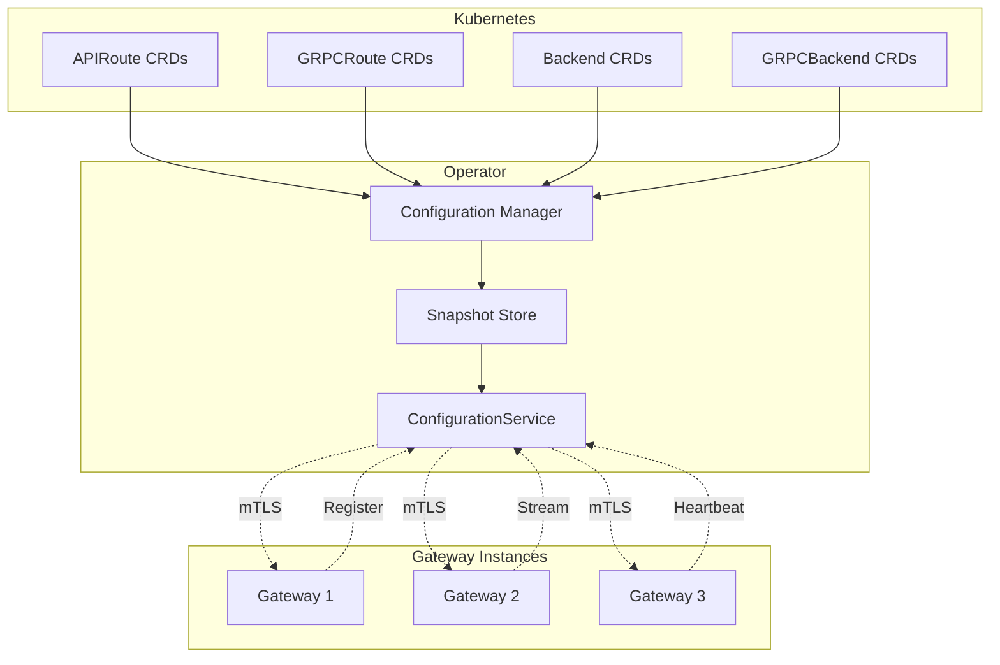
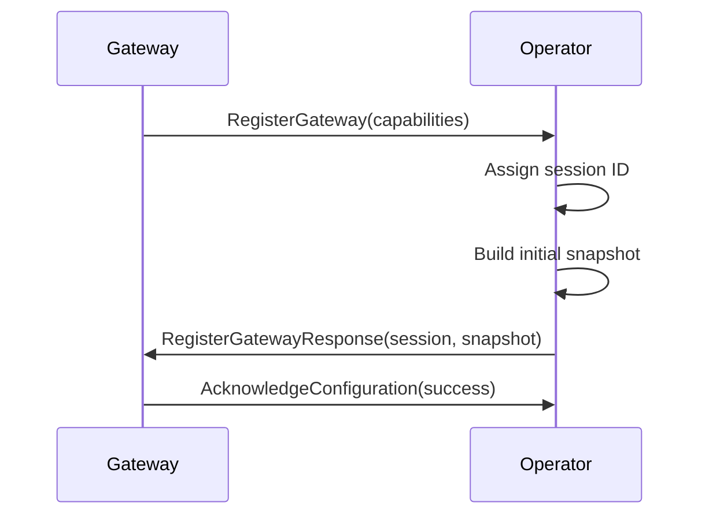
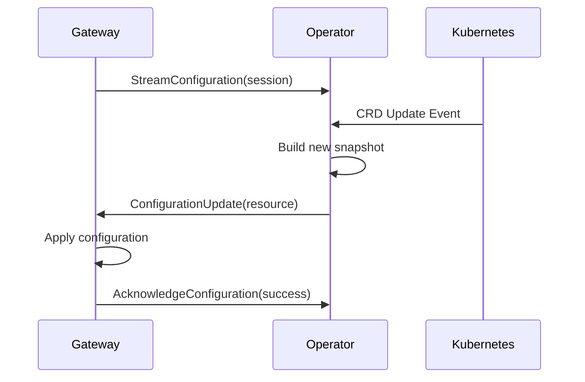
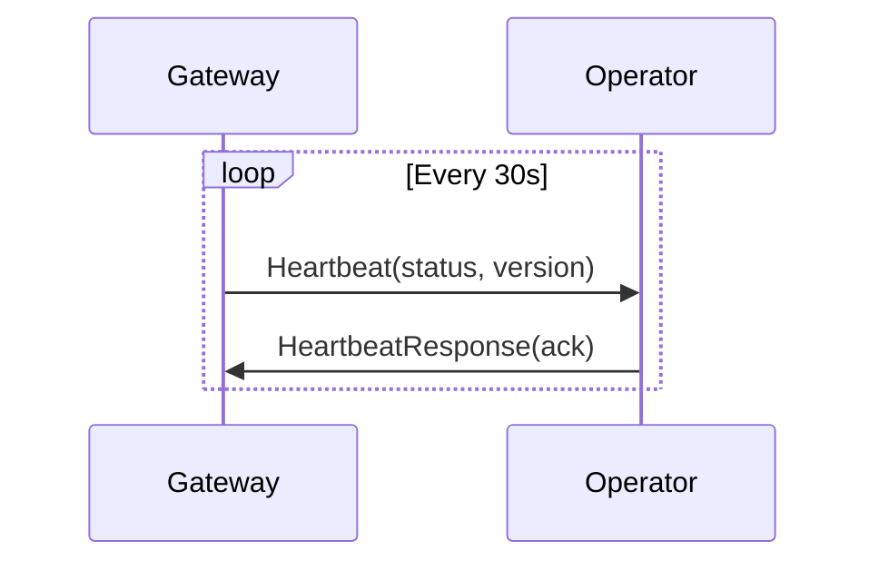

# gRPC ConfigurationService

## Overview

The AVAPIGW Operator provides a gRPC ConfigurationService that enables real-time configuration management between the operator and gateway instances. This service uses a modern streaming-based approach with comprehensive security, observability, and reliability features.

## Table of Contents

- [Architecture](#architecture)
- [Service Definition](#service-definition)
- [Configuration Flow](#configuration-flow)
- [Security](#security)
- [Observability](#observability)
- [Examples](#examples)
- [Troubleshooting](#troubleshooting)

## Architecture

The ConfigurationService implements a hub-and-spoke model where the operator acts as the central configuration authority:



### Key Components

- **ConfigurationService** - gRPC service implementation
- **Configuration Manager** - Builds configuration snapshots from CRDs
- **Snapshot Store** - In-memory storage with version tracking
- **Session Manager** - Tracks gateway connections and capabilities
- **Certificate Manager** - Handles mTLS certificates

## Service Definition

The ConfigurationService is defined in `proto/operator/v1alpha1/config.proto`:

```protobuf
service ConfigurationService {
  // RegisterGateway registers a gateway instance with the operator.
  // Returns the initial configuration snapshot.
  rpc RegisterGateway(RegisterGatewayRequest) returns (RegisterGatewayResponse);

  // StreamConfiguration establishes a server-side streaming connection
  // for receiving configuration updates from the operator.
  rpc StreamConfiguration(StreamConfigurationRequest) returns (stream ConfigurationUpdate);

  // GetConfiguration returns the current configuration snapshot.
  rpc GetConfiguration(GetConfigurationRequest) returns (ConfigurationSnapshot);

  // Heartbeat sends a keep-alive signal to the operator.
  rpc Heartbeat(HeartbeatRequest) returns (HeartbeatResponse);

  // AcknowledgeConfiguration acknowledges receipt and application of a configuration update.
  rpc AcknowledgeConfiguration(AcknowledgeConfigurationRequest) returns (AcknowledgeConfigurationResponse);
}
```

### RPC Methods

#### RegisterGateway

Registers a new gateway instance and returns the initial configuration.

**Features:**
- Session ID assignment for tracking
- Capability negotiation
- Initial configuration snapshot
- Heartbeat interval recommendation

**Usage:**
```go
resp, err := client.RegisterGateway(ctx, &operatorv1alpha1.RegisterGatewayRequest{
    Gateway: &operatorv1alpha1.GatewayInfo{
        Name:      "gateway-1",
        Namespace: "avapigw-system",
        Version:   "v1.0.0",
    },
    Capabilities: &operatorv1alpha1.GatewayCapabilities{
        HttpRoutes:      true,
        GrpcRoutes:      true,
        TlsTermination:  true,
        RateLimiting:    true,
        MaxConfigSize:   1048576, // 1MB
    },
})
```

#### StreamConfiguration

Establishes a server-side streaming connection for real-time updates.

**Features:**
- Real-time configuration updates
- Resumable streams with version tracking
- Namespace and resource type filtering
- Ordered delivery with sequence numbers

**Usage:**
```go
stream, err := client.StreamConfiguration(ctx, &operatorv1alpha1.StreamConfigurationRequest{
    SessionId:           sessionID,
    Gateway:             gatewayInfo,
    LastConfigVersion:   lastVersion,
    Namespaces:          []string{"production", "staging"},
    ResourceTypes:       []operatorv1alpha1.ResourceType{
        operatorv1alpha1.ResourceType_RESOURCE_TYPE_API_ROUTE,
        operatorv1alpha1.ResourceType_RESOURCE_TYPE_BACKEND,
    },
})

for {
    update, err := stream.Recv()
    if err != nil {
        break
    }
    // Process configuration update
}
```

#### GetConfiguration

Returns the current configuration snapshot for immediate consumption.

**Features:**
- Complete configuration state
- Namespace and resource filtering
- Version tracking and checksums
- Efficient serialization

**Usage:**
```go
snapshot, err := client.GetConfiguration(ctx, &operatorv1alpha1.GetConfigurationRequest{
    SessionId:     sessionID,
    Gateway:       gatewayInfo,
    Namespaces:    []string{"production"},
    ResourceTypes: []operatorv1alpha1.ResourceType{
        operatorv1alpha1.ResourceType_RESOURCE_TYPE_API_ROUTE,
    },
})
```

#### Heartbeat

Maintains gateway registration and reports status.

**Features:**
- Session keepalive
- Status reporting
- Reconnection signaling
- Version tracking

**Usage:**
```go
resp, err := client.Heartbeat(ctx, &operatorv1alpha1.HeartbeatRequest{
    SessionId: sessionID,
    Gateway:   gatewayInfo,
    Status: &operatorv1alpha1.GatewayStatus{
        Health:              operatorv1alpha1.HealthState_HEALTH_STATE_HEALTHY,
        ActiveConnections:   150,
        RequestsPerSecond:   1000.5,
        ErrorRate:          0.01,
        MemoryBytes:        104857600, // 100MB
        CpuUsage:           0.25,
    },
    LastAppliedVersion: "123",
})
```

#### AcknowledgeConfiguration

Acknowledges successful configuration application.

**Features:**
- Delivery confirmation
- Error reporting
- Performance tracking
- Reliability assurance

**Usage:**
```go
resp, err := client.AcknowledgeConfiguration(ctx, &operatorv1alpha1.AcknowledgeConfigurationRequest{
    SessionId:     sessionID,
    Gateway:       gatewayInfo,
    ConfigVersion: "124",
    Success:       true,
    ApplyDuration: durationpb.New(50 * time.Millisecond),
})
```

## Configuration Flow

### 1. Gateway Startup



### 2. Real-time Updates



### 3. Heartbeat Maintenance



## Security

### Mutual TLS (mTLS)

All communication uses mutual TLS authentication:

```yaml
operator:
  grpc:
    port: 9444
    tls:
      mode: selfsigned  # or vault, cert-manager
    keepalive:
      time: 30s
      timeout: 10s
```

**Certificate Modes:**
- **Self-signed** - Automatically generated certificates
- **Vault PKI** - HashiCorp Vault integration
- **cert-manager** - Kubernetes-native certificate management

### Connection Security

- **TLS 1.2+ Required** - Modern TLS versions only
- **Certificate Validation** - Full certificate chain validation
- **Cipher Suite Control** - Secure cipher suites only
- **Connection Limits** - Configurable connection limits
- **Rate Limiting** - Protection against abuse

## Observability

### Prometheus Metrics

```prometheus
# gRPC request metrics
avapigw_operator_grpc_requests_total{method="RegisterGateway",status="ok"} 5
avapigw_operator_grpc_request_duration_seconds{method="GetConfiguration"} 0.015

# Connection metrics
avapigw_operator_grpc_connections_active 2
avapigw_operator_grpc_stream_connections_total{status="started"} 8

# Configuration metrics
avapigw_operator_config_push_total{status="success"} 156
avapigw_operator_gateways_connected 2
```

### OpenTelemetry Tracing

All gRPC operations include comprehensive tracing:

```go
// Example trace attributes
span.SetAttributes(
    attribute.String("gateway.name", "gateway-1"),
    attribute.String("gateway.namespace", "avapigw-system"),
    attribute.String("config_version", "123"),
    attribute.Int("total_resources", 42),
)
```

**Trace Operations:**
- RPC method execution
- Configuration snapshot building
- Certificate operations
- Error conditions

### Structured Logging

```json
{
  "level": "info",
  "ts": "2026-02-14T10:30:00Z",
  "msg": "gateway registered via gRPC",
  "name": "gateway-1",
  "namespace": "avapigw-system",
  "session_id": "uuid-12345",
  "trace_id": "abc123def456"
}
```

## Examples

### Complete Gateway Client

```go
package main

import (
    "context"
    "crypto/tls"
    "log"
    "time"

    operatorv1alpha1 "github.com/vyrodovalexey/avapigw/proto/operator/v1alpha1"
    "google.golang.org/grpc"
    "google.golang.org/grpc/credentials"
    "google.golang.org/protobuf/types/known/durationpb"
)

func main() {
    // Setup TLS credentials
    config := &tls.Config{
        Certificates: []tls.Certificate{clientCert},
        RootCAs:      caCertPool,
        ServerName:   "avapigw-operator.avapigw-system.svc",
        MinVersion:   tls.VersionTLS12,
    }

    // Connect to operator
    conn, err := grpc.Dial(
        "avapigw-operator.avapigw-system.svc:9444",
        grpc.WithTransportCredentials(credentials.NewTLS(config)),
    )
    if err != nil {
        log.Fatal(err)
    }
    defer conn.Close()

    client := operatorv1alpha1.NewConfigurationServiceClient(conn)

    // Register gateway
    resp, err := client.RegisterGateway(context.Background(), &operatorv1alpha1.RegisterGatewayRequest{
        Gateway: &operatorv1alpha1.GatewayInfo{
            Name:      "gateway-1",
            Namespace: "avapigw-system",
            Version:   "v1.0.0",
        },
        Capabilities: &operatorv1alpha1.GatewayCapabilities{
            HttpRoutes:     true,
            GrpcRoutes:     true,
            TlsTermination: true,
            RateLimiting:   true,
            MaxConfigSize:  1048576,
        },
    })
    if err != nil {
        log.Fatal(err)
    }

    sessionID := resp.SessionId
    log.Printf("Registered with session ID: %s", sessionID)

    // Apply initial configuration
    if resp.InitialConfig != nil {
        log.Printf("Applying initial config version: %s", resp.InitialConfig.Version)
        // Apply configuration logic here
        
        // Acknowledge successful application
        _, err = client.AcknowledgeConfiguration(context.Background(), &operatorv1alpha1.AcknowledgeConfigurationRequest{
            SessionId:     sessionID,
            Gateway:       resp.InitialConfig.ApiRoutes[0].Name, // Example
            ConfigVersion: resp.InitialConfig.Version,
            Success:       true,
            ApplyDuration: durationpb.New(50 * time.Millisecond),
        })
        if err != nil {
            log.Printf("Failed to acknowledge config: %v", err)
        }
    }

    // Start streaming updates
    go streamUpdates(client, sessionID)

    // Start heartbeat
    go sendHeartbeats(client, sessionID, resp.HeartbeatInterval.AsDuration())

    // Keep running
    select {}
}

func streamUpdates(client operatorv1alpha1.ConfigurationServiceClient, sessionID string) {
    stream, err := client.StreamConfiguration(context.Background(), &operatorv1alpha1.StreamConfigurationRequest{
        SessionId: sessionID,
        Gateway: &operatorv1alpha1.GatewayInfo{
            Name:      "gateway-1",
            Namespace: "avapigw-system",
        },
    })
    if err != nil {
        log.Fatal(err)
    }

    for {
        update, err := stream.Recv()
        if err != nil {
            log.Printf("Stream error: %v", err)
            break
        }

        log.Printf("Received update: type=%s, version=%s", update.Type, update.Version)

        switch update.Type {
        case operatorv1alpha1.UpdateType_UPDATE_TYPE_FULL_SYNC:
            log.Printf("Full sync with %d total resources", update.Snapshot.TotalResources)
            // Apply full configuration
        case operatorv1alpha1.UpdateType_UPDATE_TYPE_ADDED:
            log.Printf("Resource added: %s", update.Resource.Name)
            // Apply new resource
        case operatorv1alpha1.UpdateType_UPDATE_TYPE_MODIFIED:
            log.Printf("Resource modified: %s", update.Resource.Name)
            // Update existing resource
        case operatorv1alpha1.UpdateType_UPDATE_TYPE_DELETED:
            log.Printf("Resource deleted: %s", update.Resource.Name)
            // Remove resource
        }

        // Acknowledge the update
        _, err = client.AcknowledgeConfiguration(context.Background(), &operatorv1alpha1.AcknowledgeConfigurationRequest{
            SessionId:     sessionID,
            ConfigVersion: update.Version,
            Success:       true,
            ApplyDuration: durationpb.New(25 * time.Millisecond),
        })
        if err != nil {
            log.Printf("Failed to acknowledge update: %v", err)
        }
    }
}

func sendHeartbeats(client operatorv1alpha1.ConfigurationServiceClient, sessionID string, interval time.Duration) {
    ticker := time.NewTicker(interval)
    defer ticker.Stop()

    for range ticker.C {
        resp, err := client.Heartbeat(context.Background(), &operatorv1alpha1.HeartbeatRequest{
            SessionId: sessionID,
            Gateway: &operatorv1alpha1.GatewayInfo{
                Name:      "gateway-1",
                Namespace: "avapigw-system",
            },
            Status: &operatorv1alpha1.GatewayStatus{
                Health:            operatorv1alpha1.HealthState_HEALTH_STATE_HEALTHY,
                ActiveConnections: 150,
                RequestsPerSecond: 1000.5,
                ErrorRate:         0.01,
            },
            LastAppliedVersion: "latest",
        })
        if err != nil {
            log.Printf("Heartbeat failed: %v", err)
            continue
        }

        if resp.ShouldReconnect {
            log.Printf("Operator requested reconnection: %s", resp.Message)
            // Handle reconnection logic
        }
    }
}
```

## Troubleshooting

### Common Issues

#### 1. Connection Failures

**Symptoms:**
```
Error: connection refused
Error: certificate verification failed
```

**Solutions:**
- Verify operator is running and gRPC port is accessible
- Check mTLS certificate configuration
- Validate network connectivity and firewall rules
- Review certificate expiry and rotation

#### 2. Registration Failures

**Symptoms:**
```
Error: registration failed: invalid capabilities
Error: session creation failed
```

**Solutions:**
- Verify gateway capabilities match operator expectations
- Check gateway metadata and labels
- Review operator logs for detailed error messages
- Ensure proper RBAC permissions

#### 3. Stream Interruptions

**Symptoms:**
```
Error: stream closed unexpectedly
Error: configuration updates not received
```

**Solutions:**
- Check network stability and connection timeouts
- Verify heartbeat intervals and operator health
- Review stream resumption logic
- Monitor operator resource usage

#### 4. Configuration Application Failures

**Symptoms:**
```
Error: configuration validation failed
Error: resource application timeout
```

**Solutions:**
- Validate configuration syntax and semantics
- Check resource dependencies and references
- Review gateway resource limits and capacity
- Monitor configuration application performance

### Debugging Commands

```bash
# Check operator gRPC service
kubectl get pods -n avapigw-system -l app.kubernetes.io/name=avapigw-operator
kubectl logs -n avapigw-system -l app.kubernetes.io/name=avapigw-operator

# Test gRPC connectivity
grpcurl -insecure avapigw-operator.avapigw-system.svc:9444 list
grpcurl -insecure avapigw-operator.avapigw-system.svc:9444 avapigw.operator.v1alpha1.ConfigurationService/GetConfiguration

# Check certificates
kubectl get secrets -n avapigw-system | grep grpc
kubectl describe secret avapigw-operator-grpc-certs -n avapigw-system

# Monitor metrics
kubectl port-forward -n avapigw-system svc/avapigw-operator-metrics 8080:8080
curl http://localhost:8080/metrics | grep grpc
```

### Performance Tuning

```yaml
operator:
  grpc:
    port: 9444
    keepalive:
      time: 30s          # Reduce for faster failure detection
      timeout: 10s       # Adjust based on network latency
    maxConcurrentStreams: 100  # Limit concurrent streams
    maxRecvMsgSize: 4194304    # 4MB message size limit
    maxSendMsgSize: 4194304    # 4MB message size limit
```

## Related Documentation

- **[Operator Overview](../operator.md)** - Complete operator documentation
- **[API Reference](api-reference.md)** - Detailed API documentation
- **[Certificate Management](../webhook-configuration.md)** - TLS certificate setup
- **[Troubleshooting](troubleshooting.md)** - Common issues and solutions