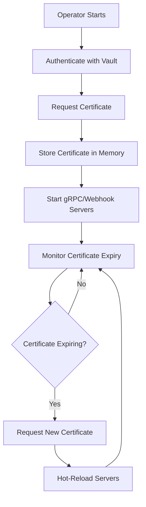

# Vault PKI Integration Guide

This guide covers setting up HashiCorp Vault PKI integration with the AVAPIGW Operator for automated certificate management.

## Table of Contents

- [Overview](#overview)
- [Prerequisites](#prerequisites)
- [Vault PKI Setup](#vault-pki-setup)
- [Kubernetes Authentication](#kubernetes-authentication)
- [Operator Configuration](#operator-configuration)
- [Certificate Management](#certificate-management)
- [Monitoring and Troubleshooting](#monitoring-and-troubleshooting)
- [Security Considerations](#security-considerations)
- [Examples](#examples)

## Overview

The AVAPIGW Operator integrates with HashiCorp Vault's PKI secrets engine to provide automated certificate management for:

- **Operator gRPC Server** - Secure communication between operator and gateways
- **Admission Webhooks** - TLS certificates for Kubernetes admission webhooks
- **Route-level TLS** - Per-route certificates for SNI-based routing
- **Backend TLS** - Client certificates for secure backend connections

### Benefits

- **Automated Certificate Lifecycle** - Automatic issuance, renewal, and rotation
- **Centralized Certificate Authority** - Single source of truth for certificates
- **Security Compliance** - Enterprise-grade certificate management
- **Scalability** - Support for multiple environments and certificate types
- **Audit Trail** - Complete certificate lifecycle auditing

## Prerequisites

### Vault Requirements

- HashiCorp Vault 1.12+ running and accessible
- Vault PKI secrets engine enabled
- Root CA certificate generated
- Appropriate Vault policies configured

### Kubernetes Requirements

- Kubernetes 1.23+
- Service account token projection (enabled by default)
- Network connectivity from operator pods to Vault

### RBAC Requirements

- Vault Kubernetes authentication method enabled
- Service account bound to Vault role with PKI permissions

## Vault PKI Setup

### 1. Enable PKI Secrets Engine

```bash
# Enable PKI secrets engine
vault secrets enable pki

# Configure maximum lease TTL
vault secrets tune -max-lease-ttl=87600h pki

# Generate root CA certificate
vault write pki/root/generate/internal \
    common_name="AVAPIGW Root CA" \
    issuer_name="root-2026" \
    ttl=87600h

# Configure PKI URLs
vault write pki/config/urls \
    issuing_certificates="$VAULT_ADDR/v1/pki/ca" \
    crl_distribution_points="$VAULT_ADDR/v1/pki/crl"
```

### 2. Create Intermediate CA (Recommended)

```bash
# Enable intermediate PKI
vault secrets enable -path=pki_int pki

# Configure intermediate PKI
vault secrets tune -max-lease-ttl=43800h pki_int

# Generate intermediate CSR
vault write -format=json pki_int/intermediate/generate/internal \
    common_name="AVAPIGW Intermediate Authority" \
    issuer_name="avapigw-intermediate" \
    | jq -r '.data.csr' > pki_intermediate.csr

# Sign intermediate certificate with root CA
vault write -format=json pki/root/sign-intermediate \
    issuer_ref="root-2026" \
    csr=@pki_intermediate.csr \
    format=pem_bundle ttl="43800h" \
    | jq -r '.data.certificate' > intermediate.cert.pem

# Set signed certificate
vault write pki_int/intermediate/set-signed certificate=@intermediate.cert.pem

# Configure intermediate URLs
vault write pki_int/config/urls \
    issuing_certificates="$VAULT_ADDR/v1/pki_int/ca" \
    crl_distribution_points="$VAULT_ADDR/v1/pki_int/crl"
```

### 3. Create PKI Roles

Create roles for different certificate types:

```bash
# Role for operator gRPC server certificates
vault write pki_int/roles/operator-server \
    issuer_ref="avapigw-intermediate" \
    allowed_domains="avapigw-system.svc,avapigw-system.svc.cluster.local" \
    allow_subdomains=true \
    allow_localhost=true \
    allow_ip_sans=true \
    max_ttl=72h \
    ttl=24h \
    key_type=rsa \
    key_bits=4096

# Role for webhook certificates
vault write pki_int/roles/webhook \
    issuer_ref="avapigw-intermediate" \
    allowed_domains="avapigw-system.svc,avapigw-system.svc.cluster.local" \
    allow_subdomains=true \
    allow_localhost=true \
    allow_ip_sans=true \
    max_ttl=72h \
    ttl=24h \
    key_type=rsa \
    key_bits=4096

# Role for route-level certificates
vault write pki_int/roles/route-certs \
    issuer_ref="avapigw-intermediate" \
    allowed_domains="example.com,*.example.com" \
    allow_subdomains=true \
    allow_wildcard_certificates=true \
    max_ttl=168h \
    ttl=72h \
    key_type=rsa \
    key_bits=2048

# Role for backend client certificates
vault write pki_int/roles/backend-client \
    issuer_ref="avapigw-intermediate" \
    allowed_domains="gateway-client,*.gateway-client" \
    allow_subdomains=true \
    allow_localhost=true \
    max_ttl=72h \
    ttl=24h \
    key_type=rsa \
    key_bits=2048
```

## Kubernetes Authentication

### 1. Enable Kubernetes Auth Method

```bash
# Enable Kubernetes auth method
vault auth enable kubernetes

# Configure Kubernetes auth
vault write auth/kubernetes/config \
    token_reviewer_jwt="$(cat /var/run/secrets/kubernetes.io/serviceaccount/token)" \
    kubernetes_host="https://$KUBERNETES_PORT_443_TCP_ADDR:443" \
    kubernetes_ca_cert=@/var/run/secrets/kubernetes.io/serviceaccount/ca.crt \
    issuer="https://kubernetes.default.svc.cluster.local"
```

### 2. Create Vault Policies

```bash
# Create policy for operator
vault policy write avapigw-operator - <<EOF
# PKI certificate issuance
path "pki_int/issue/operator-server" {
  capabilities = ["create", "update"]
}

path "pki_int/issue/webhook" {
  capabilities = ["create", "update"]
}

path "pki_int/issue/route-certs" {
  capabilities = ["create", "update"]
}

path "pki_int/issue/backend-client" {
  capabilities = ["create", "update"]
}

# Certificate revocation
path "pki_int/revoke" {
  capabilities = ["create", "update"]
}

# Read PKI configuration
path "pki_int/config/ca" {
  capabilities = ["read"]
}

path "pki_int/cert/ca" {
  capabilities = ["read"]
}

# Read roles
path "pki_int/roles/*" {
  capabilities = ["read"]
}
EOF

# Create policy for gateway instances (if needed)
vault policy write avapigw-gateway - <<EOF
# Read CA certificate
path "pki_int/cert/ca" {
  capabilities = ["read"]
}

# Issue client certificates for backend connections
path "pki_int/issue/backend-client" {
  capabilities = ["create", "update"]
}
EOF
```

### 3. Create Kubernetes Auth Roles

```bash
# Create role for operator
vault write auth/kubernetes/role/avapigw-operator \
    bound_service_account_names=avapigw-operator \
    bound_service_account_namespaces=avapigw-system \
    policies=avapigw-operator \
    ttl=24h

# Create role for gateway instances (if needed)
vault write auth/kubernetes/role/avapigw-gateway \
    bound_service_account_names=avapigw \
    bound_service_account_namespaces=avapigw-system,default \
    policies=avapigw-gateway \
    ttl=24h
```

## Operator Configuration

### 1. Helm Values Configuration

Configure the operator to use Vault PKI:

```yaml
# values-vault.yaml
vault:
  enabled: true
  address: "https://vault.example.com:8200"
  authMethod: kubernetes
  role: avapigw-operator
  kubernetesMountPath: kubernetes

grpc:
  tls:
    mode: vault
    vault:
      pkiMount: pki_int
      role: operator-server
      commonName: avapigw-operator.avapigw-system.svc
      altNames:
        - avapigw-operator.avapigw-system.svc.cluster.local
        - localhost
      ipSans:
        - 127.0.0.1
      ttl: 24h
      renewBefore: 1h

webhook:
  tls:
    mode: vault
    vault:
      pkiMount: pki_int
      role: webhook
      commonName: avapigw-operator-webhook.avapigw-system.svc
      altNames:
        - avapigw-operator-webhook.avapigw-system.svc.cluster.local
      ttl: 24h
      renewBefore: 1h
```

### 2. Install Operator with Vault

```bash
# Install operator with Vault configuration
helm install avapigw-operator ./helm/avapigw-operator \
  --namespace avapigw-system \
  --create-namespace \
  --values values-vault.yaml

# Verify installation
kubectl get pods -n avapigw-system
kubectl logs -l app.kubernetes.io/name=avapigw-operator -n avapigw-system
```

### 3. Environment Variable Configuration

Alternative configuration using environment variables:

```yaml
extraEnv:
  - name: VAULT_ADDR
    value: "https://vault.example.com:8200"
  - name: VAULT_AUTH_METHOD
    value: "kubernetes"
  - name: VAULT_ROLE
    value: "avapigw-operator"
  - name: VAULT_KUBERNETES_MOUNT_PATH
    value: "kubernetes"
  - name: GRPC_TLS_MODE
    value: "vault"
  - name: GRPC_VAULT_PKI_MOUNT
    value: "pki_int"
  - name: GRPC_VAULT_PKI_ROLE
    value: "operator-server"
  - name: WEBHOOK_TLS_MODE
    value: "vault"
  - name: WEBHOOK_VAULT_PKI_MOUNT
    value: "pki_int"
  - name: WEBHOOK_VAULT_PKI_ROLE
    value: "webhook"
```

## Certificate Management

### 1. Automatic Certificate Lifecycle

The operator automatically manages certificate lifecycle:



### 2. Certificate Renewal

Certificates are automatically renewed before expiry:

```yaml
# Configure renewal timing
grpc:
  tls:
    vault:
      ttl: 24h                     # Certificate TTL
      renewBefore: 1h              # Renew 1 hour before expiry
      renewJitter: 10m             # Random jitter for renewal
```

### 3. Certificate Storage

Certificates are stored securely:

- **In-Memory** - Primary storage for active certificates
- **Kubernetes Secrets** - Optional backup storage
- **Vault Lease Management** - Automatic lease renewal

### 4. Certificate Rotation

Hot certificate rotation without service interruption:

```bash
# Monitor certificate rotation
kubectl logs -l app.kubernetes.io/name=avapigw-operator -n avapigw-system | grep certificate

# Example log output:
# {"level":"info","msg":"Certificate renewed successfully","component":"grpc-server","expires":"2026-02-03T19:00:00Z"}
# {"level":"info","msg":"Certificate rotated","component":"webhook-server","expires":"2026-02-03T19:00:00Z"}
```

## Monitoring and Troubleshooting

### 1. Certificate Metrics

Monitor certificate status via Prometheus metrics:

```bash
# Check certificate metrics
curl http://operator:8080/metrics | grep certificate

# Example metrics:
# avapigw_operator_certificate_expiry_seconds{component="grpc"} 86400
# avapigw_operator_certificate_renewal_total{component="grpc"} 5
# avapigw_operator_certificate_renewal_errors_total{component="grpc"} 0
```

### 2. Certificate Status

Check certificate status in operator logs:

```bash
# View certificate status
kubectl logs -l app.kubernetes.io/name=avapigw-operator -n avapigw-system | grep -E "(certificate|vault)"

# Example output:
# {"level":"info","msg":"Vault authentication successful","method":"kubernetes","role":"avapigw-operator"}
# {"level":"info","msg":"Certificate issued","component":"grpc","cn":"avapigw-operator.avapigw-system.svc","expires":"2026-02-03T19:00:00Z"}
```

### 3. Vault Audit Logs

Monitor certificate operations in Vault:

```bash
# Check Vault audit logs
vault audit list
vault read sys/audit/file

# Example audit entry:
# {
#   "type": "request",
#   "auth": {
#     "client_token": "hmac-sha256:...",
#     "accessor": "hmac-sha256:...",
#     "display_name": "kubernetes-avapigw-system-avapigw-operator"
#   },
#   "request": {
#     "operation": "update",
#     "path": "pki_int/issue/operator-server",
#     "data": {
#       "common_name": "avapigw-operator.avapigw-system.svc"
#     }
#   }
# }
```

### 4. Common Issues and Solutions

#### Issue: Vault Authentication Failed

```bash
# Check service account token
kubectl get serviceaccount avapigw-operator -n avapigw-system -o yaml

# Verify Vault Kubernetes auth configuration
vault read auth/kubernetes/config

# Check operator logs
kubectl logs -l app.kubernetes.io/name=avapigw-operator -n avapigw-system | grep auth
```

#### Issue: Certificate Issuance Failed

```bash
# Check PKI role configuration
vault read pki_int/roles/operator-server

# Verify operator has correct permissions
vault token lookup

# Check certificate request details in logs
kubectl logs -l app.kubernetes.io/name=avapigw-operator -n avapigw-system | grep -A5 -B5 "certificate.*error"
```

#### Issue: Certificate Renewal Failed

```bash
# Check certificate expiry
kubectl logs -l app.kubernetes.io/name=avapigw-operator -n avapigw-system | grep expiry

# Verify Vault connectivity
kubectl exec -it deployment/avapigw-operator -n avapigw-system -- sh
# Inside pod: curl -k $VAULT_ADDR/v1/sys/health
```

## Security Considerations

### 1. Network Security

- **TLS Encryption** - All Vault communication uses TLS
- **Network Policies** - Restrict operator-to-Vault communication
- **Firewall Rules** - Limit Vault access to authorized sources

### 2. Authentication Security

- **Service Account Tokens** - Use projected tokens with audience
- **Token Rotation** - Regular service account token rotation
- **Least Privilege** - Minimal Vault policies and permissions

### 3. Certificate Security

- **Key Rotation** - Regular certificate renewal
- **Secure Storage** - In-memory certificate storage
- **Audit Trail** - Complete certificate lifecycle auditing

### 4. Vault Security

- **Vault Sealing** - Ensure Vault is properly sealed when not in use
- **Access Controls** - Implement proper Vault access controls
- **Backup and Recovery** - Regular Vault backups and disaster recovery

## Examples

### 1. Development Environment

```yaml
# values-dev-vault.yaml
vault:
  enabled: true
  address: "http://vault.local:8200"
  authMethod: token
  token: "hvs.CAESIJ..."           # Development token

grpc:
  tls:
    mode: vault
    vault:
      pkiMount: pki
      role: dev-operator
      commonName: avapigw-operator.avapigw-test.svc
      ttl: 1h                      # Short TTL for testing

webhook:
  tls:
    mode: vault
    vault:
      pkiMount: pki
      role: dev-webhook
      commonName: avapigw-operator-webhook.avapigw-test.svc
      ttl: 1h
```

### 2. Production Environment

```yaml
# values-prod-vault.yaml
vault:
  enabled: true
  address: "https://vault.example.com:8200"
  authMethod: kubernetes
  role: avapigw-operator-prod
  kubernetesMountPath: kubernetes

grpc:
  tls:
    mode: vault
    vault:
      pkiMount: pki_prod
      role: operator-server-prod
      commonName: avapigw-operator.avapigw-system.svc
      altNames:
        - avapigw-operator.avapigw-system.svc.cluster.local
        - operator.avapigw.example.com
      ttl: 24h
      renewBefore: 2h

webhook:
  tls:
    mode: vault
    vault:
      pkiMount: pki_prod
      role: webhook-prod
      commonName: avapigw-operator-webhook.avapigw-system.svc
      altNames:
        - avapigw-operator-webhook.avapigw-system.svc.cluster.local
      ttl: 24h
      renewBefore: 2h

# Additional security
networkPolicy:
  enabled: true
  egress:
    - to:
        - namespaceSelector:
            matchLabels:
              name: vault-system
      ports:
        - protocol: TCP
          port: 8200
```

### 3. Multi-Environment Setup

```bash
# Create environment-specific PKI mounts
vault secrets enable -path=pki_dev pki
vault secrets enable -path=pki_staging pki
vault secrets enable -path=pki_prod pki

# Create environment-specific roles
vault write pki_dev/roles/operator-server \
    allowed_domains="avapigw-dev.svc" \
    ttl=1h

vault write pki_staging/roles/operator-server \
    allowed_domains="avapigw-staging.svc" \
    ttl=12h

vault write pki_prod/roles/operator-server \
    allowed_domains="avapigw-system.svc" \
    ttl=24h

# Create environment-specific auth roles
vault write auth/kubernetes/role/avapigw-operator-dev \
    bound_service_account_names=avapigw-operator \
    bound_service_account_namespaces=avapigw-dev \
    policies=avapigw-operator-dev

vault write auth/kubernetes/role/avapigw-operator-staging \
    bound_service_account_names=avapigw-operator \
    bound_service_account_namespaces=avapigw-staging \
    policies=avapigw-operator-staging

vault write auth/kubernetes/role/avapigw-operator-prod \
    bound_service_account_names=avapigw-operator \
    bound_service_account_namespaces=avapigw-system \
    policies=avapigw-operator-prod
```

For more advanced Vault PKI configurations and enterprise features, see the [HashiCorp Vault PKI documentation](https://developer.hashicorp.com/vault/docs/secrets/pki).