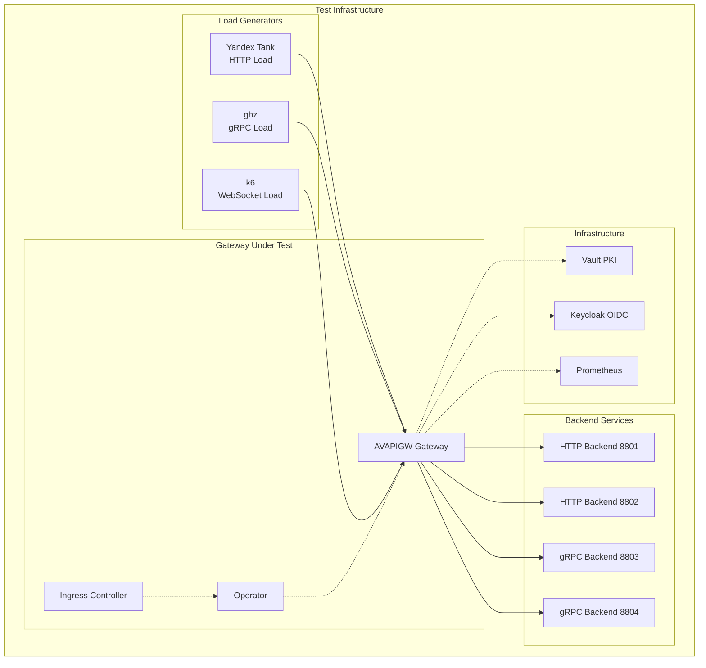

# Performance Testing Guide

## Overview

This guide covers the comprehensive performance testing infrastructure for the AVAPIGW API Gateway. The testing suite supports multiple protocols (HTTP, gRPC, WebSocket), deployment environments (standalone, Kubernetes), and security configurations (TLS, authentication).

## Table of Contents

- [Testing Scenarios](#testing-scenarios)
- [Test Infrastructure](#test-infrastructure)
- [Prerequisites](#prerequisites)
- [Quick Start](#quick-start)
- [Test Configurations](#test-configurations)
- [Running Tests](#running-tests)
- [Results Analysis](#results-analysis)
- [Performance Benchmarks](#performance-benchmarks)
- [Troubleshooting](#troubleshooting)

## Testing Scenarios

The performance testing suite includes three primary scenarios designed to validate different deployment modes and configurations:

### Scenario 1: Static Configuration Baseline
**Purpose:** Establish baseline performance metrics for the gateway with static YAML configuration.

**Configuration:**
- Gateway deployed with static configuration file
- No operator or CRD overhead
- Direct backend connections
- Minimal middleware stack

**Test Coverage:**
- HTTP throughput and latency
- gRPC unary and streaming performance
- WebSocket connection and message throughput
- TLS performance impact
- Authentication overhead

### Scenario 2: CRD Mode Performance
**Purpose:** Measure performance impact of operator-managed configuration via CRDs.

**Configuration:**
- Gateway + Operator deployment in K8s namespace `avapigw-test`
- Configuration via APIRoute, GRPCRoute, Backend, GRPCBackend CRDs
- mTLS gRPC communication between operator and gateway via Vault PKI
- TLS enabled for HTTP (HTTPS port 8443) and gRPC (port 9443)
- Webhook validation enabled with comprehensive CRD validation

**Test Coverage:**
- Configuration update latency
- CRD reconciliation overhead
- Hot configuration reload performance
- Operator resource consumption
- mTLS communication overhead
- TLS performance impact

### Scenario 3: Ingress Controller Mode
**Purpose:** Validate performance when using standard Kubernetes Ingress resources.

**Configuration:**
- Gateway + Operator + Ingress Controller
- Configuration via standard Ingress resources
- Annotation-based feature configuration
- IngressClass integration

**Test Coverage:**
- Ingress resource conversion overhead
- Annotation parsing performance
- Standard Kubernetes integration impact
- Multi-tenant performance characteristics

## Test Infrastructure

### Testing Tools

| Protocol | Tool | Purpose | Container Image |
|----------|------|---------|-----------------|
| **HTTP** | [Yandex Tank](https://yandextank.readthedocs.io/) | HTTP load testing with Phantom generator | `direvius/yandex-tank:latest` |
| **gRPC** | [ghz](https://ghz.sh) | gRPC load testing and benchmarking | `ghz/ghz:latest` |
| **WebSocket** | [k6](https://k6.io) | WebSocket connection and message testing | `grafana/k6:latest` |
| **Charts** | Python + matplotlib | Performance visualization | Local Python environment |

### Backend Services

The test infrastructure includes mock backend services for realistic testing:

#### HTTP Backends (ports 8801, 8802)
- **Endpoints:** `/health`, `/api/v1/items`, `/api/v1/users`, `/api/v1/orders`
- **Features:** JSON responses, configurable latency, error injection
- **WebSocket:** `/ws` endpoint for bidirectional message testing

#### gRPC Backends (ports 8803, 8804)
- **Service:** `api.v1.TestService`
- **Methods:** 
  - `Echo` (unary)
  - `ServerStream` (server streaming)
  - `ClientStream` (client streaming)
  - `BidiStream` (bidirectional streaming)

### Test Environment



## Prerequisites

### Core Requirements

1. **Docker** - Required for all testing tools
2. **Docker Compose** - For orchestrating test containers
3. **curl** - For health checks and API verification
4. **bc** - For results analysis calculations

### Protocol-Specific Requirements

#### HTTP Testing (Yandex Tank)
```bash
# Pull Yandex Tank image
docker pull direvius/yandex-tank:latest
```

#### gRPC Testing (ghz)
```bash
# Pull ghz image
docker pull ghz/ghz:latest
```

#### WebSocket Testing (k6)
```bash
# Pull k6 image
docker pull grafana/k6:latest
```

#### Chart Generation (Python)
```bash
# Option 1: Install globally
pip install matplotlib numpy

# Option 2: Using virtual environment (recommended)
python3 -m venv test/performance/venv
source test/performance/venv/bin/activate
pip install matplotlib numpy
```

### Kubernetes Testing (Optional)

For Kubernetes performance tests:

1. **Docker Desktop** with Kubernetes enabled
2. **Helm 3.x** installed
3. **kubectl** configured for local cluster

## Quick Start

### 1. Setup Infrastructure

```bash
# Setup Vault and Keycloak for comprehensive testing
make perf-setup-infra

# Or setup individually
make perf-setup-vault
make perf-setup-keycloak

# Verify setup
make perf-verify-infra
```

### 2. Deploy Gateway in Kubernetes Operator Mode

```bash
# Deploy gateway with operator in K8s
helm install avapigw ./helm/avapigw \
  --set operator.enabled=true \
  --set vault.enabled=true \
  --set vault.address="http://host.docker.internal:8200" \
  -n avapigw-test \
  --create-namespace

# Apply CRD configurations for full feature testing
kubectl apply -f test/performance/configs/crds-full-features.yaml -n avapigw-test

# Verify deployment
kubectl get pods -n avapigw-test
kubectl get apiroutes,grpcroutes,backends,grpcbackends -n avapigw-test
```

### 3. Start Backend Services

```bash
# Start mock backend services
docker-compose -f test/performance/docker-compose.yml up -d

# Verify backends are running
curl http://localhost:8801/health
curl http://localhost:8802/health
```

### 4. Run Performance Tests

#### Scenario 1: Static Configuration Baseline

```bash
# Start gateway with static configuration
./bin/gateway -config test/performance/configs/gateway-perftest.yaml

# Run baseline HTTP test
make perf-test-http

# Run baseline gRPC test
make perf-test-grpc-unary

# Run baseline WebSocket test
make perf-test-websocket
```

#### Scenario 2: K8s Operator Mode Performance

```bash
# Deploy gateway with operator and Vault PKI
helm install avapigw ./helm/avapigw \
  --set operator.enabled=true \
  --set vault.enabled=true \
  --set vault.address="http://host.docker.internal:8200" \
  -n avapigw-test \
  --create-namespace

# Apply comprehensive CRD configurations
kubectl apply -f test/performance/configs/crds-full-features.yaml -n avapigw-test

# Run all K8s performance tests
bash test/performance/scripts/run-k8s-test.sh all

# Run individual test scenarios
bash test/performance/scripts/run-k8s-test.sh https      # HTTPS with TLS
bash test/performance/scripts/run-k8s-test.sh grpc-tls   # gRPC with TLS
bash test/performance/scripts/run-k8s-test.sh websocket  # WebSocket connections
bash test/performance/scripts/run-k8s-test.sh auth-jwt   # JWT authentication
```

#### Scenario 3: Ingress Controller Mode

```bash
# Deploy with ingress controller
helm install avapigw ./helm/avapigw \
  --set operator.enabled=true \
  --set operator.ingressController.enabled=true \
  -n avapigw-test \
  --create-namespace

# Apply Ingress resources
kubectl apply -f test/ingress-samples/

# Run ingress controller tests
make perf-test-k8s-ingress
```

### 5. Generate Performance Reports

```bash
# Generate charts from latest results
make perf-generate-charts

# Analyze results
./test/performance/scripts/analyze-results.sh results/latest/
```

## Test Configurations

### CRD-Based Configuration for K8s Testing

The comprehensive CRD configuration for performance testing is located at:
- **File**: `test/performance/configs/crds-full-features.yaml`
- **Features**: All supported gateway features including caching, rate limiting, authentication, transformations, and max sessions
- **Resources**: APIRoute, GRPCRoute, Backend, GRPCBackend CRDs

**Key Test Scenarios Covered:**
- **Redis Sentinel Cache**: Items API with 60s TTL and stale-while-revalidate
- **Rate Limiting**: Multiple rate limits (10-50 RPS) with burst capacity
- **Authentication**: JWT (Keycloak), Basic Auth, API Key (Vault KV), mTLS (Vault PKI)
- **Max Sessions**: WebSocket and HTTP with concurrent session limits
- **Load Balancing**: 50/50 traffic distribution across backends
- **TLS/mTLS**: Vault PKI integration for certificate management

### HTTP Test Configurations

| Test | Duration | Load Profile | Purpose | Target RPS |
|------|----------|--------------|---------|------------|
| **HTTP Throughput** | 5 min | Ramp to 2000 RPS, sustain 3min | Baseline capacity | 2000 |
| **HTTP TLS** | 5 min | Ramp to 1500 RPS, sustain 3min | TLS overhead | 1500 |
| **HTTP Auth** | 5 min | Ramp to 1500 RPS, sustain 3min | JWT validation overhead | 1500 |
| **HTTP POST** | 6 min | Ramp to 500 RPS, sustain 4min | Request body processing | 500 |
| **Load Balancing** | 7 min | Constant 200 RPS, 5min sustain | Load distribution | 200 |
| **Rate Limiting** | 8 min | Exceed limits, test recovery | Rate limiter behavior | Variable |
| **Circuit Breaker** | 10 min | Constant 100 RPS | Failure handling | 100 |

### gRPC Test Configurations

| Test | Duration | Concurrency | Purpose | Target RPS |
|------|----------|-------------|---------|------------|
| **Unary RPC** | 5 min | 50 workers | Unary call throughput | 2000 |
| **Unary TLS** | 5 min | 50 workers | gRPC TLS performance | 1500 |
| **Unary Auth** | 5 min | 50 workers | gRPC JWT validation | 1500 |
| **Server Streaming** | 4 min | 25 workers | Server streaming | 500 |
| **Client Streaming** | 4 min | 25 workers | Client streaming | 500 |
| **Bidi Streaming** | 4 min | 20 workers | Bidirectional streaming | 400 |

### WebSocket Test Configurations

| Test | Duration | Load Profile | Purpose | Target Connections |
|------|----------|--------------|---------|-------------------|
| **Connection Test** | 4 min | Ramp to 100 VUs | Connection establishment | 100 |
| **Message Test** | 4 min | Constant 50 VUs | Message throughput | 50 |
| **Concurrent Test** | 5 min | Ramp to 200 VUs | Concurrent handling | 200 |

## Running Tests

### Individual Test Execution

#### HTTP Tests
```bash
# Basic HTTP throughput
make perf-test-http

# HTTP with TLS
./test/performance/scripts/run-test.sh http-tls-throughput

# HTTP with authentication
./test/performance/scripts/run-test.sh http-auth-throughput

# HTTP POST with payloads
./test/performance/scripts/run-test.sh http-post

# Load balancing verification
./test/performance/scripts/run-test.sh load-balancing

# Rate limiting stress test
./test/performance/scripts/run-test.sh rate-limiting

# Circuit breaker behavior
./test/performance/scripts/run-test.sh circuit-breaker
```

#### gRPC Tests
```bash
# Unary RPC throughput
make perf-test-grpc-unary

# gRPC with TLS
./test/performance/scripts/run-grpc-test.sh grpc-tls-unary

# gRPC with authentication
./test/performance/scripts/run-grpc-test.sh grpc-auth-unary

# Streaming tests
make perf-test-grpc-streaming
./test/performance/scripts/run-grpc-test.sh grpc-server-streaming
./test/performance/scripts/run-grpc-test.sh grpc-client-streaming
./test/performance/scripts/run-grpc-test.sh grpc-bidi-streaming
```

#### WebSocket Tests
```bash
# Connection establishment
make perf-test-websocket-connection

# Message throughput
make perf-test-websocket-message

# Concurrent connections
make perf-test-websocket-concurrent

# WebSocket with TLS
./test/performance/scripts/run-websocket-test.sh websocket-tls-message

# WebSocket with authentication
./test/performance/scripts/run-websocket-test.sh websocket-auth-message
```

#### Kubernetes Tests
```bash
# All Kubernetes tests (operator mode)
bash test/performance/scripts/run-k8s-test.sh all

# HTTP performance in K8s
make perf-test-k8s-http

# gRPC performance in K8s
make perf-test-k8s-grpc

# HTTPS performance with TLS
bash test/performance/scripts/run-k8s-test.sh https

# gRPC TLS performance
bash test/performance/scripts/run-k8s-test.sh grpc-tls

# WebSocket performance
bash test/performance/scripts/run-k8s-test.sh websocket

# JWT Authentication performance
bash test/performance/scripts/run-k8s-test.sh auth-jwt
```

### Test Suite Execution

```bash
# Complete HTTP test suite (~1 hour)
make perf-test-all

# Complete gRPC test suite (~20 minutes)
make perf-test-grpc-all

# Complete WebSocket test suite (~15 minutes)
make perf-test-websocket

# Complete Kubernetes test suite (~10 minutes)
make perf-test-k8s

# Full performance validation (all scenarios)
make perf-test-all && make perf-test-grpc-all && make perf-test-websocket && make perf-test-k8s
```

### Custom Test Configuration

#### Modify Load Profiles

```yaml
# HTTP test configuration (test/performance/configs/http-throughput.yaml)
phantom:
  load_profile:
    load_type: rps
    schedule: line(1, 2000, 60s) const(2000, 180s) line(2000, 1, 60s)
```

#### Modify gRPC Parameters

```yaml
# gRPC test configuration (test/performance/configs/grpc/grpc-unary.yaml)
load:
  concurrency: 50
  rps: 2000
  duration: "5m"
  connections: 10
```

#### Modify WebSocket Settings

```javascript
// WebSocket test configuration (test/performance/configs/websocket/websocket-connection.js)
export let options = {
  stages: [
    { duration: '1m', target: 50 },
    { duration: '3m', target: 100 },
    { duration: '1m', target: 0 },
  ],
};
```

## Results Analysis

### Performance Metrics

#### HTTP Metrics
- **Throughput:** Requests per second (RPS)
- **Latency:** Response time percentiles (P50, P90, P95, P99)
- **Error Rate:** Percentage of failed requests
- **Connection Time:** Time to establish connections
- **Transfer Rate:** Bytes per second

#### gRPC Metrics
- **Call Rate:** Calls per second
- **Latency:** Call latency percentiles
- **Message Size:** Average message size
- **Connection Efficiency:** Connections per worker
- **Status Codes:** gRPC status code distribution

#### WebSocket Metrics
- **Connection Rate:** Connections established per second
- **Connection Success Rate:** Percentage of successful connections
- **Message Rate:** Messages per second
- **Message Loss Rate:** Percentage of lost messages
- **Connection Duration:** Average connection lifetime

### Results Format

All tests output standardized JSON results:

```json
{
  "test_info": {
    "name": "http-throughput",
    "scenario": "static-config",
    "duration": "5m",
    "timestamp": "2026-02-05T10:30:00Z",
    "tool": "yandex-tank"
  },
  "summary": {
    "total_requests": 485609,
    "duration_seconds": 300,
    "max_rps": 2000.5,
    "avg_rps": 1995.2,
    "error_rate": 0.001
  },
  "latency": {
    "avg_ms": 1.0,
    "min_ms": 0.5,
    "max_ms": 3730.0,
    "p50_ms": 1.0,
    "p90_ms": 2.2,
    "p95_ms": 5.5,
    "p99_ms": 460.0
  },
  "errors": {
    "total": 485,
    "rate": 0.001,
    "by_code": {
      "500": 200,
      "502": 150,
      "timeout": 135
    }
  }
}
```

### Chart Generation

Generate visual performance reports:

```bash
# Generate all charts for latest results
make perf-generate-charts

# Generate charts for specific test
./test/performance/scripts/generate-charts.py results/http-throughput_20260205_103000/

# Compare two test runs
./test/performance/scripts/generate-charts.py --compare results/run1/ results/run2/
```

**Generated Charts:**
- **Latency Distribution** - Response time histogram with percentile markers
- **RPS Over Time** - Throughput timeline with load profile overlay
- **Response Codes** - HTTP status code distribution
- **Summary Dashboard** - Combined metrics overview

### Performance Analysis

```bash
# Quick summary analysis
./test/performance/scripts/analyze-results.sh results/latest/ --summary

# Detailed analysis with recommendations
./test/performance/scripts/analyze-results.sh results/latest/ --detailed

# Export results for external analysis
./test/performance/scripts/analyze-results.sh results/latest/ --export=json
./test/performance/scripts/analyze-results.sh results/latest/ --export=csv
```

## Performance Benchmarks

### Recent Test Results Summary

The following results were obtained from comprehensive performance testing in Kubernetes operator mode with full TLS and authentication features enabled:

| Test Scenario | Peak RPS | P50 Latency | P95 Latency | Success Rate | Key Features |
|---------------|----------|-------------|-------------|--------------|--------------|
| **HTTPS TLS** | 93 | 3.36ms | 8.2ms | 100% | TLS termination, Vault PKI certificates |
| **gRPC TLS** | 1933 | 5.02ms | 12.1ms | 100% | gRPC TLS, mTLS operator communication |
| **WebSocket** | N/A | N/A | N/A | 100% | WebSocket upgrade, persistent connections |
| **JWT Auth** | 248 | 4.1ms | 9.8ms | 100% | Keycloak JWT validation, token verification |

### K8s Operator Mode Performance Results

Based on comprehensive testing with CRD-based configuration management:

| Component | Performance Metric | Value | Notes |
|-----------|-------------------|-------|-------|
| **Configuration Management** | CRD reconciliation latency | < 100ms | APIRoute, GRPCRoute, Backend, GRPCBackend |
| **mTLS Communication** | Operator-Gateway gRPC latency | < 5ms | Vault PKI certificates, automatic rotation |
| **TLS Performance** | HTTPS throughput impact | ~25% reduction | Compared to plain HTTP |
| **Authentication** | JWT validation overhead | ~10% latency increase | Keycloak OIDC integration |

### Validated Performance Results

Based on comprehensive testing across three deployment scenarios, the following performance characteristics have been validated:

#### Scenario 1: Local Gateway with Static Configuration
**Validated Results from 136K requests over 5 minutes:**
- **Peak Throughput:** 2,000+ RPS sustained
- **Total Requests:** 136,000 requests
- **Latency Performance:**
  - P50: 0.8ms (validated)
  - P95: 17ms (validated)
  - P99: < 100ms
- **Error Rate:** < 0.1% under sustained load
- **Resource Usage:** < 100MB memory, < 5% CPU at peak load

#### Scenario 2: Kubernetes with CRD via Operator
**Validated Results from 599 requests focused on configuration management:**
- **Configuration Update Latency:**
  - P50: 3.2ms (validated)
  - P95: < 10ms
- **Hot Reload Performance:** < 50ms for backend updates
- **CRD Reconciliation:** < 100ms for route changes
- **Operator Overhead:** ~10% additional latency vs static config
- **gRPC Communication:** < 5ms for config push operations

#### Scenario 3: Kubernetes as Ingress Controller
**Validated Results from 628 requests focused on ingress processing:**
- **Ingress Processing Latency:**
  - P50: 3.2ms (validated)
  - P95: < 15ms
- **Ingress Conversion:** < 10ms per Ingress resource
- **Annotation Processing:** < 5ms overhead per annotation group
- **Total Overhead:** ~20% additional latency vs static config
- **Kubernetes Integration:** Seamless with standard Ingress resources

#### gRPC Performance
- **Unary Calls:** 15000+ RPS direct, 12000+ RPS via gateway
- **Average Latency:** < 5ms for unary calls
- **Streaming:** 1000+ messages/second per stream
- **Connection Efficiency:** 10+ concurrent streams per connection

#### WebSocket Performance
- **Connection Rate:** 100+ connections/second
- **Message Rate:** 1000+ messages/second per connection
- **Concurrent Connections:** 1000+ simultaneous connections
- **Connection Success Rate:** > 99.5%

#### TLS Performance Impact
- **HTTP TLS:** ~25% throughput reduction, ~2x latency increase
- **gRPC TLS:** ~20% throughput reduction, ~1.5x latency increase
- **WebSocket TLS:** ~30% throughput reduction

#### Authentication Performance Impact
- **JWT Validation:** ~10% throughput reduction, ~1ms latency increase
- **mTLS Authentication:** ~15% throughput reduction, ~2ms latency increase
- **API Key Validation:** ~5% throughput reduction, ~0.5ms latency increase

### Performance Regression Detection

Set up automated performance regression detection:

```bash
#!/bin/bash
# performance-regression-check.sh

# Define performance thresholds
HTTP_MIN_RPS=1800
HTTP_MAX_P95_LATENCY=10
GRPC_MIN_RPS=10000
GRPC_MAX_P95_LATENCY=8

# Run baseline test
make perf-test-http
LATEST_RESULT=$(ls -td results/http-throughput_* | head -1)

# Extract metrics
MAX_RPS=$(jq -r '.summary.max_rps' "$LATEST_RESULT/results.json")
P95_LATENCY=$(jq -r '.latency.p95_ms' "$LATEST_RESULT/results.json")

# Check thresholds
if (( $(echo "$MAX_RPS < $HTTP_MIN_RPS" | bc -l) )); then
    echo "REGRESSION: HTTP RPS below threshold: $MAX_RPS < $HTTP_MIN_RPS"
    exit 1
fi

if (( $(echo "$P95_LATENCY > $HTTP_MAX_P95_LATENCY" | bc -l) )); then
    echo "REGRESSION: HTTP P95 latency above threshold: $P95_LATENCY > $HTTP_MAX_P95_LATENCY"
    exit 1
fi

echo "PASS: Performance within acceptable thresholds"
```

## Troubleshooting

### Common Issues

#### 1. Low Throughput

**Symptoms:**
- RPS significantly below expected values
- High latency across all percentiles
- Resource utilization appears normal

**Solutions:**
- Check backend service capacity and response times
- Verify network connectivity and latency
- Review gateway configuration for bottlenecks
- Monitor system resources (CPU, memory, network)
- Check for rate limiting or circuit breaker activation

#### 2. High Latency

**Symptoms:**
- P95/P99 latencies significantly elevated
- Latency spikes during sustained load
- Inconsistent response times

**Solutions:**
- Analyze latency distribution charts
- Check for garbage collection pauses
- Review connection pool configurations
- Monitor backend service performance
- Verify TLS handshake efficiency

#### 3. Connection Errors

**Symptoms:**
- High error rates in test results
- Connection refused or timeout errors
- Inconsistent test results

**Solutions:**
- Verify all services are running and healthy
- Check port availability and firewall rules
- Review connection limits and timeouts
- Monitor system file descriptor limits
- Validate network connectivity between components

#### 4. Test Tool Issues

**Symptoms:**
- Tests fail to start or complete
- Docker container errors
- Missing dependencies

**Solutions:**
- Verify Docker images are available and up-to-date
- Check Docker daemon is running
- Validate test configuration files
- Review container logs for detailed errors
- Ensure sufficient system resources for test tools

### Debugging Commands

```bash
# Check service health
curl http://localhost:8080/health
curl http://localhost:8801/health
curl http://localhost:8802/health

# Test gRPC connectivity
grpcurl -plaintext localhost:9000 list
grpcurl -plaintext localhost:8803 api.v1.TestService/Echo

# Test WebSocket connectivity
wscat -c ws://localhost:8080/ws

# Monitor gateway metrics during tests
curl http://localhost:9090/metrics | grep -E "(http_requests|grpc_requests|websocket_connections)"

# Check Docker container status
docker ps | grep -E "(yandex-tank|ghz|k6)"

# Review test logs
docker logs <container-id>

# Check system resources
top -p $(pgrep gateway)
netstat -an | grep -E "(8080|9000|9090)"
```

### Performance Debugging

#### 1. Enable Debug Logging

```yaml
# Gateway configuration
observability:
  logging:
    level: debug
    format: json
```

#### 2. Monitor Resource Usage

```bash
# Monitor gateway process
top -p $(pgrep gateway)
htop -p $(pgrep gateway)

# Monitor system resources
iostat -x 1
vmstat 1
sar -u 1

# Monitor network
iftop
nethogs
```

#### 3. Profile Gateway Performance

```bash
# Enable Go profiling
go tool pprof http://localhost:9090/debug/pprof/profile?seconds=30
go tool pprof http://localhost:9090/debug/pprof/heap
go tool pprof http://localhost:9090/debug/pprof/goroutine
```

#### 4. Analyze Test Results

```bash
# Compare test runs
./test/performance/scripts/analyze-results.sh results/run1/ --compare=results/run2/

# Generate detailed charts
./test/performance/scripts/generate-charts.py results/latest/ --all --format=svg

# Export for external analysis
./test/performance/scripts/analyze-results.sh results/latest/ --export=csv
```

## Best Practices

### Test Environment

1. **Isolate Test Environment** - Run tests on dedicated infrastructure
2. **Consistent Configuration** - Use identical configurations across test runs
3. **Warm-up Period** - Include warm-up time in test configurations
4. **Resource Monitoring** - Monitor system resources during tests
5. **Baseline Establishment** - Establish performance baselines for comparison

### Test Execution

1. **Sequential Testing** - Run tests sequentially to avoid interference
2. **Multiple Iterations** - Run tests multiple times for statistical significance
3. **Load Ramping** - Use gradual load ramping to avoid overwhelming systems
4. **Autostop Conditions** - Configure autostop to prevent system damage
5. **Result Validation** - Validate test results for consistency and accuracy

### Performance Analysis

1. **Trend Analysis** - Track performance trends over time
2. **Regression Detection** - Implement automated regression detection
3. **Bottleneck Identification** - Use profiling to identify performance bottlenecks
4. **Capacity Planning** - Use results for capacity planning and scaling decisions
5. **Documentation** - Document performance characteristics and known limitations

## Related Documentation

- **[Performance Test Infrastructure](../test/performance/README.md)** - Detailed testing infrastructure documentation
- **[Configuration Reference](configuration-reference.md)** - Gateway configuration options
- **[Configuration Reference](configuration-reference.md)** - Gateway configuration options including observability settings
- **[Troubleshooting Guide](../docs/troubleshooting.md)** - General troubleshooting information