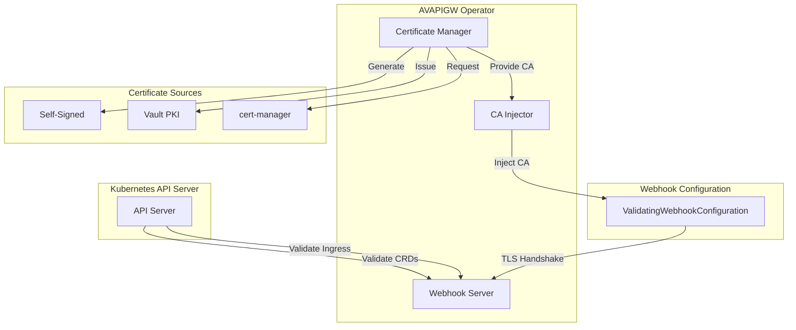

# Webhook and Certificate Configuration

## Overview

The AVAPIGW Operator uses admission webhooks for validating Custom Resource Definitions (CRDs) and Ingress resources. This document covers webhook configuration, certificate management, and troubleshooting for the three supported certificate modes: self-signed, Vault PKI, and cert-manager.

## Table of Contents

- [Webhook Architecture](#webhook-architecture)
- [Certificate Management Modes](#certificate-management-modes)
- [Self-Signed Mode](#self-signed-mode)
- [Vault PKI Mode](#vault-pki-mode)
- [Cert-Manager Mode](#cert-manager-mode)
- [Webhook CA Injection](#webhook-ca-injection)
- [Configuration Examples](#configuration-examples)
- [Monitoring and Metrics](#monitoring-and-metrics)
- [Troubleshooting](#troubleshooting)

## Webhook Architecture

The operator implements admission webhooks for comprehensive validation:



### Webhook Types

#### 1. CRD Validation Webhooks
- **APIRoute Webhook** - Validates HTTP route specifications
- **GRPCRoute Webhook** - Validates gRPC route specifications  
- **Backend Webhook** - Validates HTTP backend configurations
- **GRPCBackend Webhook** - Validates gRPC backend configurations

#### 2. Cross-CRD Validation
- **Duplicate Detection** - Prevents conflicting route configurations
- **Reference Validation** - Ensures referenced backends exist
- **Namespace Validation** - Validates cross-namespace references

#### 3. Ingress Validation (when ingress controller enabled)
- **Annotation Validation** - Validates AVAPIGW-specific annotations
- **Path Type Validation** - Validates supported path types
- **TLS Configuration Validation** - Validates TLS sections

## Certificate Management Modes

The operator supports three certificate management modes for webhook TLS:

| Mode | Description | Use Case | External Dependencies |
|------|-------------|----------|----------------------|
| **self-signed** | Automatically generated self-signed certificates | Development, testing, simple deployments | None |
| **vault** | HashiCorp Vault PKI integration | Enterprise environments with existing Vault | Vault with PKI engine |
| **cert-manager** | Kubernetes-native certificate management | Cloud-native environments | cert-manager |

### Mode Selection

```yaml
operator:
  webhook:
    tls:
      mode: selfsigned  # selfsigned, vault, cert-manager
```

## Self-Signed Mode

Self-signed mode automatically generates and manages certificates without external dependencies.

### Configuration

```yaml
operator:
  webhook:
    enabled: true
    port: 9443
    tls:
      mode: selfsigned
      # Optional: Custom certificate parameters
      validity: 8760h  # 1 year
      keySize: 2048
      organization: "AVAPIGW"
      country: "US"
```

### Features

- **Automatic Generation** - Creates CA and server certificates automatically
- **Certificate Rotation** - Automatically rotates certificates before expiry
- **CA Injection** - Injects CA bundle into ValidatingWebhookConfigurations
- **No External Dependencies** - Works out of the box
- **Configurable Parameters** - Customize certificate validity and key size

### Certificate Lifecycle

1. **Generate CA Certificate**
   ```
   Subject: CN=AVAPIGW Operator CA, O=AVAPIGW, C=US
   Validity: 10 years
   Key Size: 2048 bits
   ```

2. **Generate Server Certificate**
   ```
   Subject: CN=avapigw-operator-webhook.avapigw-system.svc, O=AVAPIGW, C=US
   SAN: 
     - avapigw-operator-webhook.avapigw-system.svc
     - avapigw-operator-webhook.avapigw-system.svc.cluster.local
     - avapigw-operator-webhook
   Validity: 1 year (configurable)
   ```

3. **Store in Kubernetes Secrets**
   ```yaml
   apiVersion: v1
   kind: Secret
   metadata:
     name: avapigw-operator-webhook-certs
     namespace: avapigw-system
   type: kubernetes.io/tls
   data:
     tls.crt: <base64-encoded-server-cert>
     tls.key: <base64-encoded-server-key>
     ca.crt: <base64-encoded-ca-cert>
   ```

4. **Inject CA into Webhook Configuration**
   ```yaml
   apiVersion: admissionregistration.k8s.io/v1
   kind: ValidatingWebhookConfiguration
   metadata:
     name: avapigw-operator-validating-webhook
   webhooks:
   - name: apiroute.avapigw.io
     clientConfig:
       caBundle: <base64-encoded-ca-cert>
   ```

### Monitoring

```prometheus
# Certificate expiry time
avapigw_operator_cert_expiry_seconds{mode="selfsigned",type="webhook"} 1640995200

# Certificate renewals
avapigw_operator_cert_renewals_total{mode="selfsigned",status="success"} 5
avapigw_operator_cert_renewals_total{mode="selfsigned",status="failure"} 0

# CA injections
avapigw_operator_webhook_ca_injections_total{status="success"} 10
avapigw_operator_webhook_ca_injections_total{status="failure"} 0
```

## Vault PKI Mode

Vault PKI mode integrates with HashiCorp Vault's PKI secrets engine for enterprise-grade certificate management.

### Prerequisites

1. **HashiCorp Vault** with PKI secrets engine enabled
2. **Kubernetes Authentication** method configured in Vault
3. **Vault Policies** allowing certificate issuance
4. **PKI Role** configured for operator certificates

### Vault Setup

#### 1. Enable PKI Secrets Engine

```bash
# Enable PKI secrets engine
vault secrets enable pki

# Configure max lease TTL
vault secrets tune -max-lease-ttl=8760h pki

# Generate root CA
vault write pki/root/generate/internal \
    common_name="AVAPIGW Root CA" \
    ttl=8760h

# Configure CA and CRL URLs
vault write pki/config/urls \
    issuing_certificates="https://vault.example.com:8200/v1/pki/ca" \
    crl_distribution_points="https://vault.example.com:8200/v1/pki/crl"
```

#### 2. Create PKI Role

```bash
# Create role for operator certificates
vault write pki/roles/operator-webhook \
    allowed_domains="avapigw-system.svc.cluster.local,avapigw-system.svc" \
    allow_subdomains=true \
    max_ttl="720h" \
    generate_lease=true \
    server_flag=true
```

#### 3. Configure Vault Policy

```hcl
# Operator webhook policy
path "pki/issue/operator-webhook" {
  capabilities = ["create", "update"]
}

path "pki/cert/ca" {
  capabilities = ["read"]
}
```

#### 4. Configure Kubernetes Authentication

```bash
# Enable Kubernetes auth method
vault auth enable kubernetes

# Configure Kubernetes auth
vault write auth/kubernetes/config \
    token_reviewer_jwt="$(cat /var/run/secrets/kubernetes.io/serviceaccount/token)" \
    kubernetes_host="https://kubernetes.default.svc:443" \
    kubernetes_ca_cert=@/var/run/secrets/kubernetes.io/serviceaccount/ca.crt

# Create role for operator
vault write auth/kubernetes/role/avapigw-operator \
    bound_service_account_names=avapigw-operator \
    bound_service_account_namespaces=avapigw-system \
    policies=avapigw-operator-webhook \
    ttl=24h
```

### Configuration

```yaml
operator:
  webhook:
    enabled: true
    port: 9443
    tls:
      mode: vault

vault:
  enabled: true
  address: "https://vault.example.com:8200"
  authMethod: kubernetes
  role: avapigw-operator
  
  # TLS configuration for Vault connection
  tls:
    enabled: true
    caSecretName: vault-ca-cert
    skipVerify: false
  
  # PKI configuration for webhook certificates
  pki:
    enabled: true
    pkiMount: "pki"
    role: "operator-webhook"
    commonName: "avapigw-operator-webhook.avapigw-system.svc"
    altNames:
      - "avapigw-operator-webhook.avapigw-system.svc.cluster.local"
      - "avapigw-operator-webhook"
    ttl: "24h"
    renewBefore: "1h"
```

### Features

- **Enterprise PKI** - Leverages Vault's enterprise-grade PKI
- **Automatic Renewal** - Certificates renewed before expiry
- **Centralized CA** - Single certificate authority for all services
- **Audit Logging** - Vault provides comprehensive audit logs
- **Policy-Based Access** - Fine-grained access control via Vault policies

### Certificate Lifecycle

1. **Authenticate with Vault** using Kubernetes service account
2. **Issue Certificate** from configured PKI role
3. **Store Certificate** in Kubernetes secret
4. **Inject CA Bundle** into webhook configurations
5. **Monitor Expiry** and renew before expiration
6. **Rotate Certificate** seamlessly without downtime

### Monitoring

```prometheus
# Vault PKI operations
avapigw_operator_vault_pki_operations_total{operation="issue",status="success"} 10
avapigw_operator_vault_pki_operations_total{operation="issue",status="failure"} 0

# Certificate expiry
avapigw_operator_cert_expiry_seconds{mode="vault",type="webhook"} 1640995200

# Vault authentication
avapigw_operator_vault_auth_total{method="kubernetes",status="success"} 50
```

## Cert-Manager Mode

Cert-manager mode integrates with the cert-manager operator for Kubernetes-native certificate management.

### Prerequisites

1. **cert-manager** installed in the cluster
2. **ClusterIssuer** or **Issuer** configured
3. **Certificate** resources for webhook certificates

### Cert-Manager Setup

#### 1. Install cert-manager

```bash
# Install cert-manager
kubectl apply -f https://github.com/cert-manager/cert-manager/releases/download/v1.13.0/cert-manager.yaml

# Verify installation
kubectl get pods -n cert-manager
```

#### 2. Create ClusterIssuer

```yaml
# Self-signed ClusterIssuer
apiVersion: cert-manager.io/v1
kind: ClusterIssuer
metadata:
  name: selfsigned-issuer
spec:
  selfSigned: {}
---
# CA ClusterIssuer
apiVersion: cert-manager.io/v1
kind: ClusterIssuer
metadata:
  name: ca-issuer
spec:
  ca:
    secretName: ca-key-pair
```

#### 3. Create Certificate Resource

```yaml
apiVersion: cert-manager.io/v1
kind: Certificate
metadata:
  name: avapigw-operator-webhook-cert
  namespace: avapigw-system
spec:
  secretName: avapigw-operator-webhook-certs
  issuerRef:
    name: ca-issuer
    kind: ClusterIssuer
  commonName: avapigw-operator-webhook.avapigw-system.svc
  dnsNames:
  - avapigw-operator-webhook.avapigw-system.svc
  - avapigw-operator-webhook.avapigw-system.svc.cluster.local
  - avapigw-operator-webhook
  duration: 8760h  # 1 year
  renewBefore: 720h  # 30 days
```

### Configuration

```yaml
operator:
  webhook:
    enabled: true
    port: 9443
    tls:
      mode: cert-manager
      # Certificate resource name (optional, auto-detected)
      certificateName: avapigw-operator-webhook-cert
      # Secret name where cert-manager stores the certificate
      secretName: avapigw-operator-webhook-certs
```

### Features

- **Kubernetes-Native** - Fully integrated with Kubernetes
- **Multiple Issuers** - Support for various certificate issuers
- **Automatic Renewal** - cert-manager handles certificate lifecycle
- **ACME Support** - Integration with Let's Encrypt and other ACME providers
- **Monitoring** - Built-in metrics and monitoring

### Certificate Lifecycle

1. **Certificate Resource** created by operator or manually
2. **cert-manager** issues certificate from configured issuer
3. **Certificate Stored** in specified Kubernetes secret
4. **CA Bundle Extracted** by operator from certificate chain
5. **CA Injected** into ValidatingWebhookConfigurations
6. **Automatic Renewal** handled by cert-manager

### Monitoring

```prometheus
# cert-manager metrics
certmanager_certificate_expiration_timestamp_seconds{name="avapigw-operator-webhook-cert"} 1640995200
certmanager_certificate_ready_status{name="avapigw-operator-webhook-cert"} 1

# Operator CA injection metrics
avapigw_operator_webhook_ca_injections_total{mode="cert-manager",status="success"} 5
```

## Webhook CA Injection

The webhook CA injector automatically manages CA certificates in ValidatingWebhookConfigurations.

### How It Works

The WebhookCAInjector is now fully implemented and automatically manages CA certificates (DEV-002):

1. **Certificate Monitoring** - Continuously watches certificate secrets for changes
2. **CA Bundle Extraction** - Extracts CA certificate from webhook TLS certificates (fixed to use CA cert instead of leaf cert)
3. **Automatic Injection** - Injects CA bundle into ValidatingWebhookConfigurations
4. **Retry Logic** - Implements exponential backoff for failed injection attempts
5. **Metrics Collection** - Comprehensive metrics for injection operations
6. **OpenTelemetry Tracing** - Full tracing support for CA injection operations

### Implementation Details

The CA injector runs as a background goroutine within the operator and:

- **Watches Certificate Secrets** - Monitors webhook certificate secrets for updates
- **Validates CA Certificates** - Ensures CA certificates are valid before injection
- **Updates Webhook Configurations** - Patches ValidatingWebhookConfiguration resources
- **Handles Multiple Webhooks** - Supports injection into multiple webhook configurations
- **Provides Status Feedback** - Reports injection status via metrics and logs
- **Supports All Certificate Modes** - Works with self-signed, Vault PKI, and cert-manager

### Configuration

```yaml
operator:
  webhook:
    caInjection:
      enabled: true
      refreshInterval: 1h
      retryBackoff:
        initialInterval: 1s
        maxInterval: 60s
        multiplier: 2.0
        maxRetries: 5
```

### Webhook Configuration Template

```yaml
apiVersion: admissionregistration.k8s.io/v1
kind: ValidatingWebhookConfiguration
metadata:
  name: avapigw-operator-validating-webhook
  annotations:
    cert-manager.io/inject-ca-from: avapigw-system/avapigw-operator-webhook-cert
webhooks:
- name: apiroute.avapigw.io
  clientConfig:
    service:
      name: avapigw-operator-webhook
      namespace: avapigw-system
      path: /validate-avapigw-io-v1alpha1-apiroute
    caBundle: ""  # Injected automatically
  rules:
  - operations: ["CREATE", "UPDATE"]
    apiGroups: ["avapigw.io"]
    apiVersions: ["v1alpha1"]
    resources: ["apiroutes"]
  admissionReviewVersions: ["v1", "v1beta1"]
  failurePolicy: Fail
```

### Monitoring CA Injection

```prometheus
# CA injection operations
avapigw_operator_webhook_ca_injections_total{status="success"} 10
avapigw_operator_webhook_ca_injections_total{status="failure"} 0

# CA injection duration
avapigw_operator_webhook_ca_injection_duration_seconds 0.123

# Last injection time
avapigw_operator_webhook_ca_injection_last_time 1640995200
```

## Configuration Examples

### Development Environment (Self-Signed)

```yaml
operator:
  enabled: true
  webhook:
    enabled: true
    port: 9443
    tls:
      mode: selfsigned
      validity: 8760h
    failurePolicy: Ignore  # Allow failures during development
  
  resources:
    limits:
      cpu: 200m
      memory: 128Mi
    requests:
      cpu: 100m
      memory: 64Mi
```

### Production Environment (Vault PKI)

```yaml
operator:
  enabled: true
  replicaCount: 2  # HA deployment
  
  webhook:
    enabled: true
    port: 9443
    tls:
      mode: vault
    failurePolicy: Fail
    
  leaderElection:
    enabled: true
    
  resources:
    limits:
      cpu: 500m
      memory: 256Mi
    requests:
      cpu: 100m
      memory: 128Mi

vault:
  enabled: true
  address: "https://vault.production.example.com:8200"
  authMethod: kubernetes
  role: avapigw-operator-prod
  
  tls:
    enabled: true
    caSecretName: vault-ca-cert
    skipVerify: false
  
  pki:
    enabled: true
    pkiMount: "pki-production"
    role: "operator-webhook-prod"
    commonName: "avapigw-operator-webhook.avapigw-system.svc"
    ttl: "24h"
    renewBefore: "2h"
```

### Cloud-Native Environment (cert-manager)

```yaml
operator:
  enabled: true
  
  webhook:
    enabled: true
    port: 9443
    tls:
      mode: cert-manager
      certificateName: avapigw-operator-webhook-cert
      secretName: avapigw-operator-webhook-certs
    failurePolicy: Fail

# Separate Certificate resource
---
apiVersion: cert-manager.io/v1
kind: Certificate
metadata:
  name: avapigw-operator-webhook-cert
  namespace: avapigw-system
spec:
  secretName: avapigw-operator-webhook-certs
  issuerRef:
    name: letsencrypt-prod
    kind: ClusterIssuer
  commonName: avapigw-operator-webhook.avapigw-system.svc
  dnsNames:
  - avapigw-operator-webhook.avapigw-system.svc
  - avapigw-operator-webhook.avapigw-system.svc.cluster.local
  duration: 2160h  # 90 days
  renewBefore: 720h  # 30 days
```

## Monitoring and Metrics

### Webhook Metrics

```prometheus
# Webhook request metrics
avapigw_operator_webhook_requests_total{webhook="apiroute",status="allowed"} 100
avapigw_operator_webhook_requests_total{webhook="apiroute",status="denied"} 2
avapigw_operator_webhook_duration_seconds{webhook="apiroute"} 0.005

# Certificate metrics
avapigw_operator_cert_expiry_seconds{mode="vault",type="webhook"} 1640995200
avapigw_operator_cert_renewals_total{mode="vault",status="success"} 5

# CA injection metrics
avapigw_operator_webhook_ca_injections_total{status="success"} 10
avapigw_operator_webhook_ca_injection_duration_seconds 0.123
```

### Alerting Rules

```yaml
groups:
- name: avapigw-operator-webhooks
  rules:
  - alert: WebhookCertificateExpiringSoon
    expr: (avapigw_operator_cert_expiry_seconds - time()) < 86400
    for: 5m
    labels:
      severity: warning
    annotations:
      summary: "Webhook certificate expiring soon"
      description: "Certificate expires in less than 24 hours"

  - alert: WebhookValidationFailing
    expr: rate(avapigw_operator_webhook_requests_total{status="denied"}[5m]) > 0.1
    for: 2m
    labels:
      severity: critical
    annotations:
      summary: "High webhook validation failure rate"
      description: "Webhook validation failing at {{ $value }}/sec"

  - alert: CAInjectionFailing
    expr: rate(avapigw_operator_webhook_ca_injections_total{status="failure"}[5m]) > 0
    for: 1m
    labels:
      severity: critical
    annotations:
      summary: "CA injection failures detected"
      description: "CA injection failing for webhook configurations"
```

## Troubleshooting

### Common Issues

#### 1. Webhook Certificate Errors

**Symptoms:**
```
Error: x509: certificate signed by unknown authority
Error: tls: bad certificate
```

**Solutions:**
- Check certificate validity: `openssl x509 -in cert.pem -text -noout`
- Verify CA bundle injection in ValidatingWebhookConfiguration
- Check certificate SAN includes webhook service name
- Ensure certificate is not expired

#### 2. CA Injection Failures

**Symptoms:**
```
Error: failed to update ValidatingWebhookConfiguration: access denied
Error: CA bundle injection failed
```

**Solutions:**
- Verify RBAC permissions for ValidatingWebhookConfigurations
- Check operator has access to certificate secrets
- Review CA injector logs for detailed errors
- Ensure webhook configuration exists

#### 3. Vault PKI Issues

**Symptoms:**
```
Error: failed to authenticate with Vault
Error: certificate request denied by Vault
```

**Solutions:**
- Verify Vault connectivity and authentication
- Check PKI role configuration and permissions
- Validate Vault policies allow certificate issuance
- Review Vault audit logs for detailed errors

#### 4. cert-manager Integration Issues

**Symptoms:**
```
Error: Certificate resource not found
Error: certificate not ready
```

**Solutions:**
- Verify cert-manager is installed and running
- Check Certificate resource status: `kubectl describe certificate`
- Validate ClusterIssuer/Issuer configuration
- Review cert-manager logs for certificate issuance errors

### Debugging Commands

```bash
# Check webhook certificates
kubectl get secrets -n avapigw-system | grep webhook
kubectl describe secret avapigw-operator-webhook-certs -n avapigw-system

# Check webhook configuration
kubectl get validatingwebhookconfiguration avapigw-operator-validating-webhook -o yaml

# Test webhook connectivity
kubectl apply --dry-run=server -f test-apiroute.yaml

# Check certificate expiry
openssl x509 -in <(kubectl get secret avapigw-operator-webhook-certs -n avapigw-system -o jsonpath='{.data.tls\.crt}' | base64 -d) -text -noout | grep "Not After"

# Check CA injection
kubectl get validatingwebhookconfiguration avapigw-operator-validating-webhook -o jsonpath='{.webhooks[0].clientConfig.caBundle}' | base64 -d | openssl x509 -text -noout

# Monitor webhook metrics
kubectl port-forward -n avapigw-system svc/avapigw-operator-metrics 8080:8080
curl http://localhost:8080/metrics | grep webhook
```

### Log Analysis

Enable debug logging for detailed troubleshooting:

```yaml
operator:
  logLevel: debug
  logFormat: json
```

Look for these log patterns:
- `Certificate issued successfully` - Certificate management events
- `CA bundle injected` - CA injection events
- `Webhook validation` - Admission webhook processing
- `Certificate renewal` - Certificate rotation events
- `Vault authentication successful` - Vault PKI operations

## Best Practices

### Security

1. **Use Strong Certificates** - Use appropriate key sizes and validity periods
2. **Rotate Regularly** - Configure short TTL and automatic renewal
3. **Secure Vault Access** - Use least-privilege Vault policies
4. **Monitor Expiry** - Set up alerts for certificate expiration
5. **Validate Configurations** - Test webhook validation thoroughly

### Performance

1. **Optimize Webhook Latency** - Keep validation logic efficient
2. **Configure Timeouts** - Set appropriate webhook timeouts
3. **Monitor Metrics** - Track webhook performance and errors
4. **Batch Operations** - Minimize API server calls
5. **Cache Certificates** - Avoid unnecessary certificate operations

### Reliability

1. **Handle Failures Gracefully** - Implement proper error handling
2. **Use Failure Policies** - Configure appropriate webhook failure policies
3. **Monitor Health** - Set up comprehensive monitoring
4. **Test Disaster Recovery** - Test certificate recovery procedures
5. **Document Procedures** - Maintain operational runbooks

## Related Documentation

- **[Operator Overview](operator.md)** - Complete operator documentation
- **[Installation Guide](operator/installation.md)** - Detailed installation instructions
- **[Vault PKI Integration](vault-pki-integration.md)** - Vault PKI setup and configuration
- **[Troubleshooting](operator/troubleshooting.md)** - Common issues and solutions